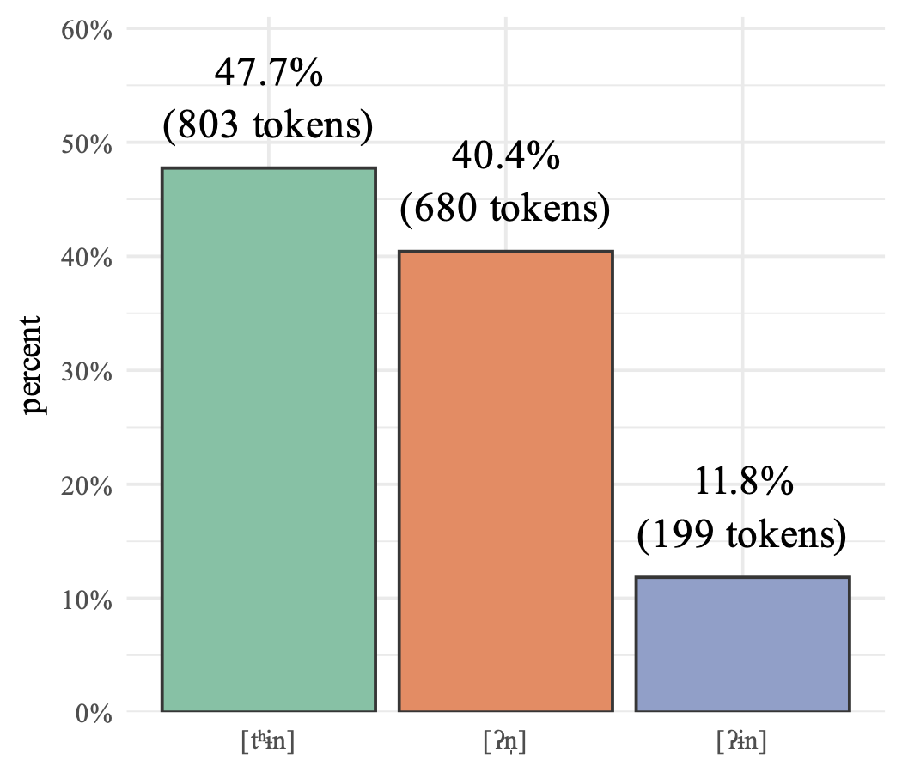
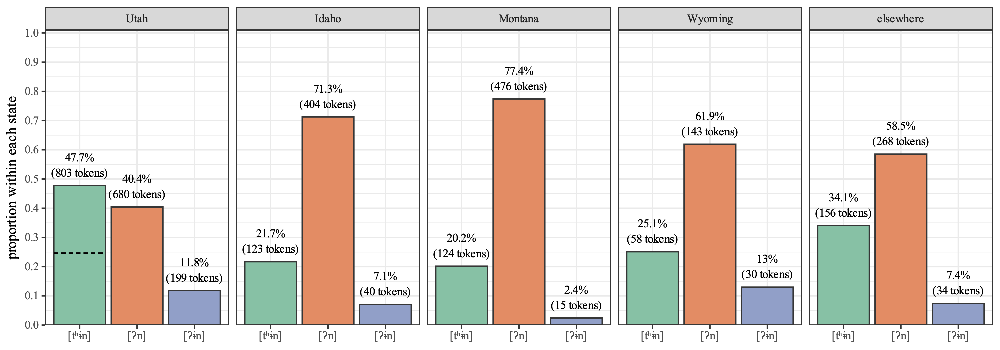
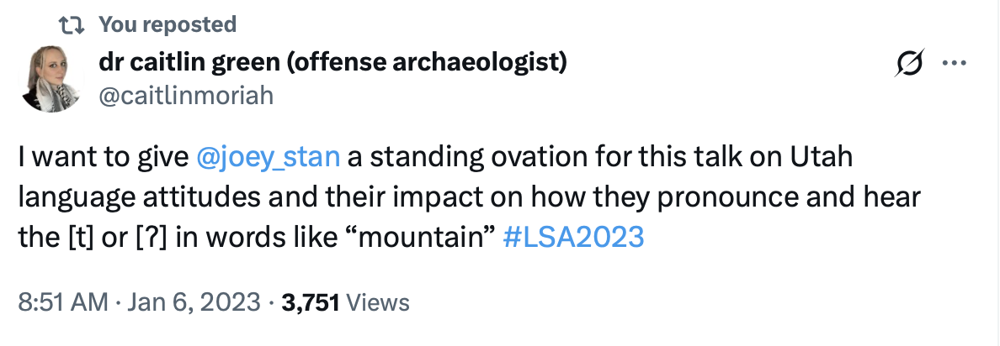

I'm so happy that my latest paper, "Hypercorrect Moun[tʰɨn] in Utah English", has been [published](https://www.jbe-platform.com/content/journals/10.1075/eww.25028.sta) in *English World-Wide*! This is the first of two papers that are based on my [2023 presentation at LSA](/blog/ads-and-lsa-2023/index.html), some of which [I wrote about](https://joeystanley.com/blog/ida3ho-montana-wyoming-and-utah-english-survey-results/) in September 2022. Here's a summary of the paper and some behind-the-scenes stories that went into it.

:::{.callout-note title="tl;dr"}
Utahns say [tʰ] in words like *mountain* more than people in other regions. Download the paper [here](/downloads/260316-EWW_published.pdf).
:::

## Summary

### The phenomenon

The topic of study in this paper is the realization of unstressed /tən/, as in words like *mountain*, *kitten*, and *button*. In this paper, I refer to this set of words as <sc>mountain</sc>. In §2.1 of the paper, I define the variable in detail in a way that hasn't been done yet for this variable, so if you're curious about other words that fit into the category or marginal cases, be sure to check that out. I focus on three phonetic categories of <sc>mountain</sc>: the North American standard [ʔn̩], a realization that is stigmatized in Utah [ʔɨn], and the  hypercorrect [tʰɨn]. In Utah, where my study is focused, some research over the past decade or so has shown some mixed results, but it has mostly focused on [ʔɨn]. While I talk about all three variants, this is the first to focus specifically on [tʰɨn]. 

### The findings

My hypothesis was that Utahns say [tʰɨn] more than other dialect areas do. So, I had 117 Utahns read a bunch of words in a wordlist, 17 of which belong to <sc>mountain</sc>. I analyzed those realizations just by listening to them. Overall, I found that Utahns used [tʰɨn] 47.7% of the time!

{width=360}

First, I found that some words were more likely to be [tʰɨn] than others. Specifically, if the preceding segment was a nasal (i.e. *mountain*, *sentence*, *Scranton*), [tʰɨn] was more likely. But, it appears that there's quite a lot of unexplained variation in the words themselves. That'll have to be analyzed further in later work.

As for demographic factors, I didn't find too many significant predictors for who said which variant. [ʔn̩] was more common among former Latter-day Saints and people who want to live in small towns. [tʰɨn] was used less among former Latter-day Saints, people who want to live in small towns or rural areas, and Gen Z. [ʔɨn] was used more among Millennials and Gen Z. However, like the words, there was massive variation between speakers that was not accounted for by the predictors incorporated into this model.

To see if Utahns indeed do this more than others, I collected comparable data from Idahoans, Wyomingites, Montanans, and a general sample of North American English speakers. Here's a plot showing this comparison across regions:

On average, the other regions used [tʰɨn] about 25% of the time. That means that Utahns used it almost twice as much! 

:::{.callout-note title="Here's the paper's main finding"}
These Utahns used [tʰɨn] in <sc>mountain</sc> words 47.7% of the time, nearly double that of other regions.
:::

### Broader implications

This study showed that Utahns used a lot more [tʰɨn] in <sc>mountain</sc> words than the other people sampled. Why do they do that? Well, I argue that it's a hypercorrection in response to stigma associated with the glottal stop in [ʔn̩]. I have a whole separate paper that goes into this, so you'll have to wait for that to come out to get the full story. Or you can look at my [2023 presentation](/blog/ads-and-lsa-2023/index.html) since it's all there.

More generally though, I think this is just on of several instances of broader pattern in Utah. Specifically, fortition. In Utah, we see lots of consonantal variables realized in "stronger" ways than they are in most other areas of North America. Stops are inserted after word-final velar nasals (*sing* [sɪŋɡ] ~ [sɪŋk]), [t] is inserted between /ls/ clusters (*else* [ɛɫ ͡ts]), and /θ/ is affricated after /l/ (*health* [hɛɫ͡t̪θ]). Again, I have a whole separate paper that goes into detail about why this is, so stay tuned for that soon.

Released /t/ has been studied in lots of studies, including a few high-profile works that are foundational to the study of indexicality. This paper offers just one more look into that variable in one phonological context and in one region. 

## Behind the scenes

I like hearing about the behind the scenes of others' papers, so I try to provide that background on my own. Here's the story about this one.

### Teasing the main claim of this paper

This is a paper I've been wanting to publish for almost a decade! In early 2017, I noticed that Utahns say [tʰɨn] a lot, so I started throwing words like *mountain*, *kitten*, and *button* into some wordlists. You can read about my early findings in [Stanley & Vanderniet (2018)](https://openscholar.uga.edu/record/748?v=pdf) where I basically make the same observations about the increased frequency of [tʰɨn]. That data was based on recordings from Amazon Mechanical Turk workers that I collected in the summer of 2017. I sat on that observation for a while, but because I didn't have the chance to collect new data from Utah for a few years, the only place where that claim was made was in that proceedings paper.

In 2021, I collected the data I used for the current paper. It's based on Reddit users reading wordlists and I've used it for a few papers already ([Stanley & Shepherd 2025](https://journals.sagepub.com/doi/10.1177/00754242251343916), [Stanley, Stevenson, & Baker-Smemoe 2024](https://doi.org/10.3765/plsa.v9i1.5701)) and a few others still in the works based on some conference talks ([Stanley & Jackson 2023](/blog/ads-and-lsa-2023) on Idaho English, [Stanley 2026](/blog/ads-and-lsa-2026/) on meta-linguistic commentary, and Stanley & Davidson 2026 on other aspects of Utah English). 

As early as September 2022, I posted some of the results that eventually made their way into this paper [in this blog post](https://joeystanley.com/blog/idaho-montana-wyoming-and-utah-english-survey-results/index.html). That post was intended for survey participants so they could see the results since many of them asked. But the plot comparing <sc>mountain</sc> words across four states is very similar to Figure 8 in my paper.

In January 2023, I presented these results at [LSA in Denver](/blog/ads-and-lsa-2023). If I may toot my own horn a little bit, I think it was an awesome talk. And I think other people felt that way too. The seating was full and there was a small crowd of people standing in the back. Several Utahns validated my findings in the Q&A session. I was told that people were talking about it and one person said it was the highlight of the conference. And Dr. Caitlin Green very kindly tweeted this afterwards. 

{width=600}

So, the main claim of this paper---that Utahns say [tʰɨn] more than other people---has been said in three places already: Stanley & Vanderniet (2018), my blog post, and my LSA 2023 presentation. It was time to get it in a peer-reviewed, published venue!

### Writing the paper

But, time got away from me, and I didn't get much of a chance to write up the talk into a paper. I taught a new course that semester (Sociolinguistic Fieldwork) and in Fall 2023 I prioritized working on a paper with a student before she graduated (which eventually became [Stanley & Shepherd 2025]((https://journals.sagepub.com/doi/10.1177/00754242251343916))). 

I put off this paper partially because I wanted to go all in on a phonetic analysis. I didn't really have time to do any of that until finals week in April 2024. In Footnote 10, I explain the kinds of acoustic measurements I wanted to examine. It was intimidating to start all that with the data that I had, and when I finally got started on it, I realized the variable sound quality was going to make it impossible anyway.

So, I decided to double-down on my auditory analysis. I say in the paper that I listened to all the data and coded the tokens auditorily twice, with nine months separating them. So the first time was around August 2023 and the second time was at the end of April 2024. That wasn't a methodological choice! It was simply that I went through them once, set the project on the back burner for a bit, and then went through them again. I then had two colleagues listen to some of the tokens so I could get an inter-rater reliability score. The reason why I wanted to make this auditory analysis so robust was because reviewer comments in a different paper that also used auditory classifications gave us a bit of grief and I wanted to avoid that this time.

### Finding a home for the paper

By the end of May 2024, I had a nearly complete paper. But the problem was that it was about 15,000 words. I had a clear phonetics side of the analysis and a clear story-telling discussion side of the paper. I knew that I'd have to split it, but that would take serious reworking for both of them. That was a bit discouraging, so I put the paper off a little bit longer. I had some other due dates coming up, including abstracts for [LSA 2025](/blog/ads-and-lsa-2025) and reviewing proofs for [Stanley, Renwick, & Nesbitt (2024)](https://read.dukeupress.edu/pads/issue/109/1). 

On July 1, 2024, I on-a-whim submitted it to *Language*. I felt like this was a good paper so I decided to aim high. But also it's one of the few journals that accepts manuscripts that long and I really didn't want to split it. I figured it wouldn't get accepted, but I could use some good feedback. In October 2024, it was rejected. But now I had the task of incorporating all this useful feedback on beefing up the theoretical impact while also making it several thousand words shorter. 

So I trimmed and trimmed and trimmed. At the end of January 2025 I had it down to just under 10,000 words (if you don't count the footnotes) and I submitted it to *Language Variation & Change*. It got desk rejected, partially for being too long when footnotes were included. But they left open the possibility of seeing another version. So I decided to finally split the paper into a phonetics side and a qualitative side. So I rewrote the phonetics version of the paper (an earlier draft of what was eventually published this week) and submitted it. It was desk rejected again though, partially for not be quantitative enough. (Even though the final version had more stats, the version I submitted indeed didn't really have much.) 

With two desk rejects, I wasn't thrilled about the article's prospects. Again, I really like this study! I talk about these findings all the time with friends and students and my LSA presentation was well-attended! So, I was getting discouraged at where it'll end up. I considered a few other places like *Journal of English Linguistics* or *American Speech*, but I had [other](/blog/new-publication-in-jengl) papers under review with them and they might not allow me to submit another one. 

So I submitted  it to *English World-Wide*. It admittedly was not my top pick of journal, partially because BYU doesn't even subscribe to it, which means my students won't have access to the paper. It stuck though. In May 2025, it made it past desk reject; in July 2025 I got an R&R; in August 2025 it was resubmitted; and in November 2025 it got a conditional accept. There were several rounds of proofs (turns out I had a fair amount of IPA and formatting!) in February and March and it finally got published on March 13.

The way the paper ended up was way more quantitative than the original submission. A very helpful reviewer suggested some areas to improve and I ended up reworking basically the entire results section. The result was quite a bit of stats. Nothing more complicated than a regression model, but many of my claims were now backed up by quantitative support. I had a half a mind to withdraw from *English World-Wide* and resubmitting *again* to *Language Variation and Change* since they wanted more stats. But I didn't want to restart the clock on this one, so I went forward with *English World-Wide*.

### Where is Part 2?

Since I split the paper, you might be wondering what has happened to the other half. Of course Plan A was to publish this as a single article because they really are two perspectives on the same thing. But I just couldn't hack away 40% of the paper, so I very reluctantly split it.

Plan B then was to submit them about the same time to two different journals, have them cite each other a lot, and then have them get published around the same time. Well, qualitative analysis is not my forte, so I'm having a hard time getting this second half to land somewhere. (It has been desk rejected twice after splitting.) So, even though it's been a fully-written manuscript for 10 months, I'm still trying to find a home for it and I haven't had time to rework it to fit certain journal's expectations. Hopefully this summer I can get it to stick. 

While it should work out in the long run, right now we're in a weird point where the *English World-Wide* paper cites a future paper quite a lot in the discussion section. It makes the observation about <sc>mountain</sc> but offers little explanation for why. (Reviewers were quick to point this out too.) I do have a good explanation for it and lots of data to support it, but I just didn't have the room to include it in the current paper. Hopefully I can get the qualitative, Part 2 paper out soon and close that open parenthesis. 

