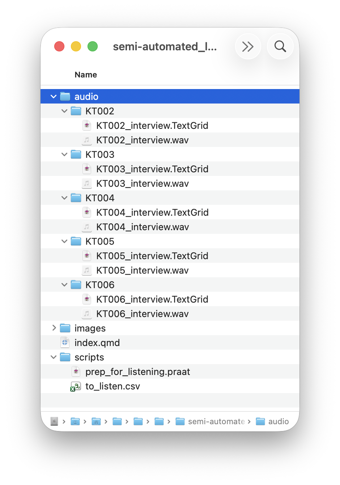
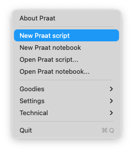
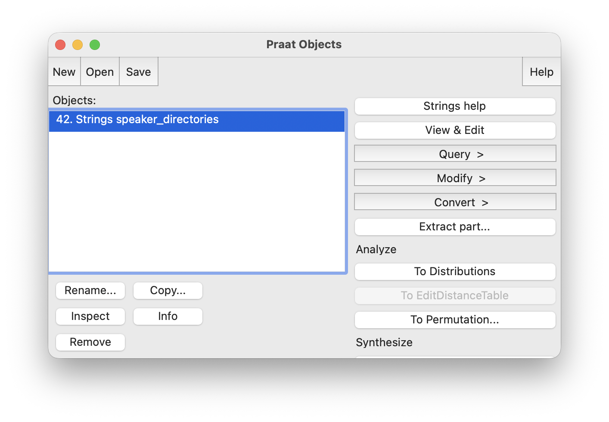
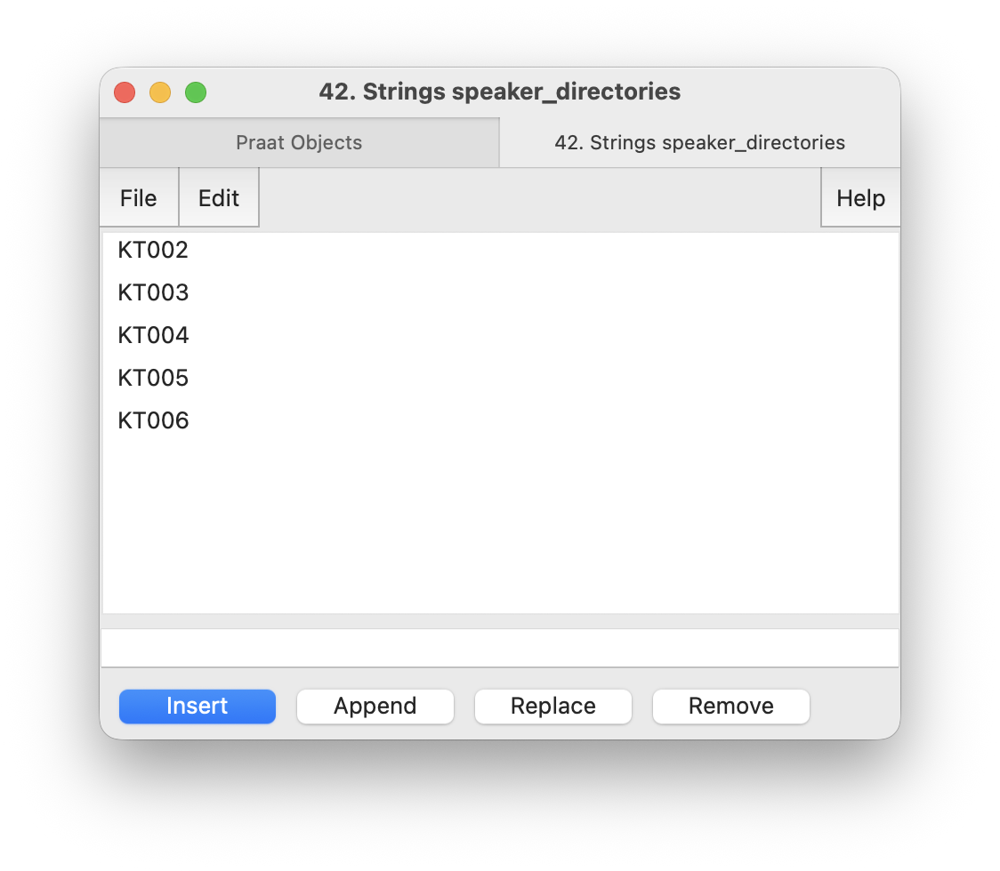
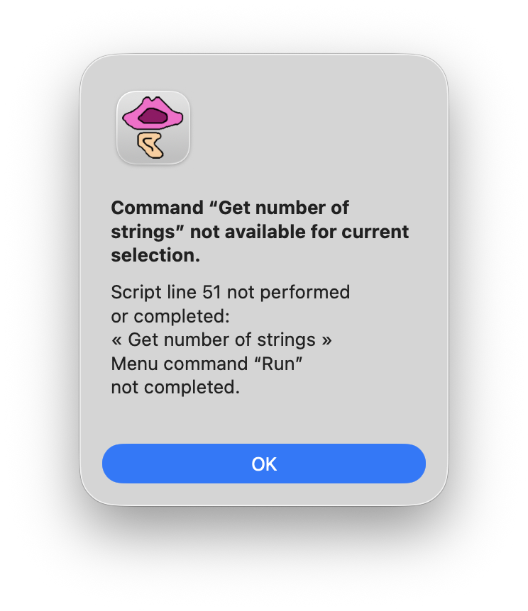
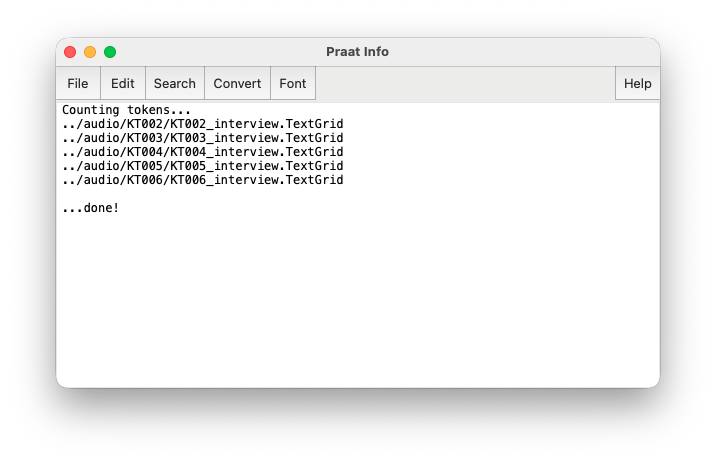
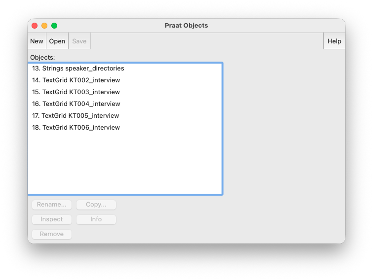
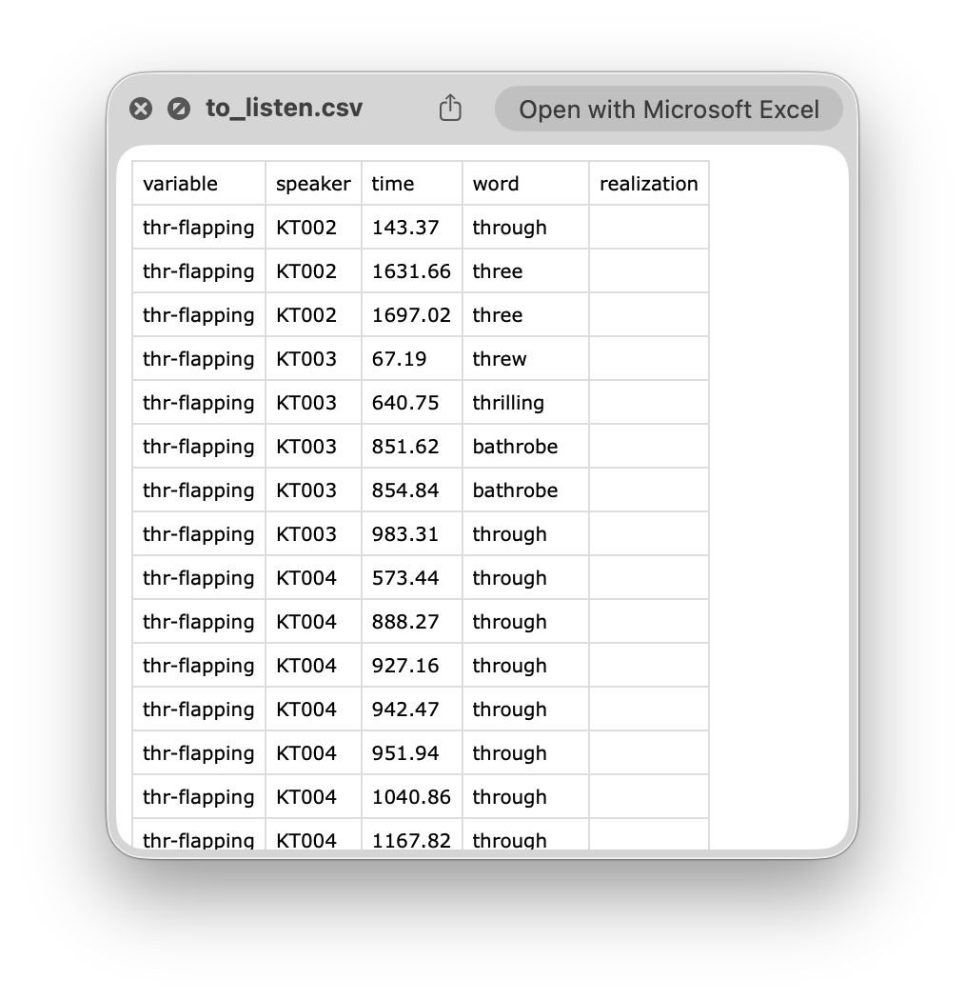

This tutorial will show you how to write a Praat script that will greatly speed up the time it takes to listen to and code for linguistic variables in a collection of audio files. For example, you have audio from 25 interviews and you want to find all tokens of word-final /t/ and listen for whether they're glottalized or not. It would take a careful ear to listen to the audio files from start to finish and manually transfer that information over into a spreadsheet. 

:::{.callout-note}
This tutorial assumes you are already familiar with Praat and even some Praat scripting. You can look at my previous tutorials [here](/pages/praat-workshops.html) to get yourself up to speed.
:::

This tutorial is broken up into three parts because it got way to long for a single webpage. Here is the outline:

1. The main goal of Part 1 is to write a script that creates a spreadsheet that sets everything up we need to do the listening. We'll go through our files, identify the tokens we want to work with, and export a `.csv` file that we can then read in to another script that actually handles the listening. If you already have a spreadsheet like that (for example, if you use software like [APLS](https://apls.pitt.edu/labbcat/)), then you can mostly skip this part, although your file structure may be different than what I use here.
1. The second part is where we actually write the script that does the semi-automated listening. This second script takes the data from the spreadsheet we created in Part 1 and uses it to zoom to each token one at a time. The audio plays automatically and a box shows up that lets you pick between a small number of previously deteremined options. It'll save your responses to that same spreadsheet. 
1. The third part is optional, but it builds on the script that we write in Part 2 to make some quality of life improvements. For example, we'll see how to skip over tokens you've already listened to if you need to split the listening up into two sessions, we'll see how to add additional listeners in case you want multiple people involved (and you can say how many people have to listen to each token), and we'll see how to randomize the list to prevent bias from creeping in. 

It is important to note that this script assumes Praat TextGrids with a phoneme tier and a word tier. For most people, this means it should work with output from the [Montreal Forced Aligner](https://montreal-forced-aligner.readthedocs.io/en/latest/).

## Gameplan

Let's walk through what this script is going to do. 

1. Open an audio file and its accompanying TextGrid.
1. Loop through the intervals on the phoneme tier of that TextGrid.
1. When the target phoneme encountered, check to see if the phonological environment is right.
1. Save information about that observation.

In Part 2, we'll continue the process using a separate script.

1. Load the information about the observations.
1. Play a little bit of audio while displaying the spectrogram to the user.
1. Provide the user with a pop-up window that lets them click on a predetermined set of transcriptions.
1. Save the user's selection and other metadata about the observation (start time, word, speaker, etc) into a spreadsheet.
1. Continue until all observations have been coded. 

Let's go through each of these steps and show how they might be done for different scenarios. I'll use the following examples throughout the tutorial because they're ones I've done in the past and because they demonstrate how to target a variety of phonological variables.

* flapping of /ɹ/ in /θɹ/ clusters as in *three*, *through*, or *throw*. 
* Unstressed /tən/ and whether it's released or glottalized in words like *mountain*, *kitten*, and *button*.
* Presence of /ʍ/ in words like *which*, *what*, and *where*

## File structure

I'm going to assume a file structure where there's one folder for each speaker and inside that folder are the speaker's files. You can of course program your script to do whatever you want, but that's what I'll do. 

```
--Project Directory
  |--scripts
  |  |--(the two scripts we'll write today)
  |--audio    
  |  |--speaker1
  |  |  |--speaker1.wav
  |  |  |--speaker1.TextGrid
  |  |--speaker2
  |  |  |--speaker2.wav
  |  |  |--speaker2.TextGrid
  |  |--speaker3
  |  |  |--speaker3.wav
  |  |  |--speaker3.TextGrid
  |  |--...
```

In fact, here is a screenshot of the file structure I'll use for this blog post. 

{width=60%}

The files I'll use come from a larger collection of [cassette tapes](/blog/kohler-tapes-update3/). I'll just do five for demonstration purposes but what we do in this tutorial works for any number of audio files.


## Looping through the files

The first thing we're going to do is create a spreadsheet that has the metadata about the tokens we're listening to. I like to do this first, primarily so I know how many tokens I'm dealing with and how many I have left. 

### Creating the script

Open Praat and create a new Praat script.



Go ahead and save it to your project folder in a subfolder called `scripts`. I'll call mine `prep_for_listening.praat`. 

:::{.callout-tip title="Praat scripting tip: saving your script" collapse="true"}
Remember to regularly save your script! Praat doesn't have an autosave. Just today, I lost progress on two Praat scripts, including the one used in this tutorial(!) because I didn't save. Get in the habit of regularly saving your Praat scripts!
:::

### Find speaker directories

Since we'll be looping over many files, I want to set up that loop. Normally, I'd say work with one file first and then add the looping around it, but I've personally found it more difficult to do that in Praat than in other languages. So I'll start with the big picture stuff first and then work on the details later on. Let's first define the directory where all the audio lives. 

```{r}
# Where is all the audio?
dir$ = "../audio/"
```

:::{.callout-tip title="Praat scripting tip: dollar signs" collapse="true"}
Since the information we'll store into this variable is text (as opposed to a number), the variable `dir$` must always appear with a dollar sign after it. If you do `dir` without it and try to save text into it, it'll crash.
:::

:::{.callout-tip title="General coding tip: dots in pathnames" collapse="true"}
I could have saved the full directory path (i.e `/Users/joeystan/GitHub/joeystanley/blog/semi-automated_listening_in_praat_part1/audio`). But I don't because I don't like hard-coding paths into my script. If that audio folder moves around somewhere, suddenly this script will break. 

Instead, I use a *relative* path. It's a path that is relative to where the current script lives. The `..` notation means "go up one folder". If you look up at my file structure, this script lives in a folder called `scripts`. If you go up one folder to the main folder for this project, and then go down to the `audio` folder, that's where the data lives. So, as long as the relative position of this script and the audio is the same, this code will work. That means if I move this main folder---the one that contains both `scripts` and `audio` around---this script will still work just fine.
:::

We'll then get a list of all the folders inside that directory:

```{r}
# Where is all the audio?
dir$ = "../audio/"

# Get a list of all the speakers
speakers = Create Strings as directory list: "speaker_directories", "'dir$'*"
```

That'll create a new object visible in your Praat Objects window called `speaker_directories`. 

{width=60%}

When you click on it and View & Edit, you should see a list of the folders inside your `audio` directory. 

{width=60%}

If you've gotten this far, great! We're on the right track. From here we can start our first loop and begin to loop through our files. 

:::{.callout-tip title="General scripting tip: comments" collapse="true"}
If you haven't been commenting your code, now is a good time to do that. You think you'll remember what various lines do and why, but you'll probably forget sooner than you think. Good, clear comments help avoid this issue. 

I'd also recommend putting several lines of code at the very top of the script that explains the purpose of the script, how to run it, and the date. 
:::

### Loop through speaker directories

To make a loop in Praat, you have to predetermine how many iterations we want. So I'll query that new `speaker_directories` object and get how long it is. That's done with `Get number of strings`

```{r}
n_speakers = Get number of strings
```

That number in `n_speakers` (in my case, five) is how many times the loop will happen. Here's the script so far.

```{r}
# Where is all the audio?
dir$ = "../audio/"

# Get a list of all the speakers
speakers = Create Strings as directory list: "speaker_directories", "'dir$'*"

# Loop through those speakers
n_speakers = Get number of strings
for i_speaker from 1 to n_speakers
	
endfor
```

If you run this, it'll appear as if nothing happened, but that's because very little is actually happening! Right now we're just looping through the folders. We haven't loaded the audio and TextGrid files yet. Let's do that.

:::{.callout-tip title="Praat scripting tip: loop variables" collapse="true"}
The name `i_speaker` is arbitrary. That variable stores a number that corresponds to the number range from 1 to 5 (or however many speakers you have). It is useful to have this number handy so that when we query the `speakers` object we can jump to the *ith* element in that list. 

Usually loops in programming have `i` as the variable name. I like to make mine more explicit. (In fact, I like *all* my variable names in Praat to be more explicit because Praat coding can sometimes be opaque.) But also when it comes time to do a loop within a loop (which we'll do), we won't have conflicting `i` variables or have to keep track of `i` vs. `j` (which is what you'd normally do). 

Anyway, name it what you want, but I'll keep it as `i_speaker`.
:::

:::{.callout-tip title="Praat scripting tip: selecting objects" collapse="true"} 
It's important to note that `Get number of strings` works only if the strings object is selected. In our case, since the previous line of code is where we create the strings object `speakers`, that is selected automatically. So running `Get number of strings` is safe. But if you get an error complaining about `Get number of strings` not being available for the current selection, like this…

{width=50%}

…then immediately after closing the error box, go to your Praat Objects window and see if the `speakers` object is selected/highlighted. If it's not, you'll need to explicitly have the script select it using `selectObject: speakers`. 


:::

### Open the TextGrids

Once we're inside the loop, we'll need to get some information about each speaker. First we'll query the list of speakers and get the `i_speaker`th element in that list, which is a string that is the name of that speaker's folder (`speaker_dir$`). 

```{r}
selectObject: speakers
speaker$ = Get string: i_speaker
```


I'll then use that text to infer the path to their directory, and I'll do that by concatenating the main directory (`dir$`) with the speaker (`speaker$`). 

```{r}
speaker_dir$ = "'dir$''speaker$'/"
path_to_tg$ = "'speaker_dir$''speaker$'_interview.TextGrid"
```

:::{.callout-tip title="Praat scripting tip: variables and strings" collapse="true"}
It took me way too long in my Praat scripting career to figure out the syntax for combining a mix of strings and variables. But here's what I've found:

* If you want to hard-code a string in, just put it in quotes `"like this"`. 
* If you want the name of a variable, you can keep it bare, like this: `speaker$`.
* If you want a mix of strings and variables, there are two options.
  - You can concatenate them using a `+` sign: `"This is the name of the speaker: " + speaker$`
  - You can also put the whole thing in double quotes, with the variable name in single quotes within it: `"This is the name of the speaker: 'speaker$'"`
  
I think in many of my earlier scripts, I didn't know what I was doing, and I often did things like `"'speaker$'"` which is the exact same as `speaker$` but with the extra mess of quotation marks. Anyway, so if you're curious about the quotes, that might explain it.
:::


I'll then infer the name of the TextGrid file itself. In my case, I have `_interview` tagged on to the end of each filename, so I'll have to add that to the script.^[If your filenames are less consistent than mine, you can fetch them explicitly using the [Create Strings as file list](https://www.fon.hum.uva.nl/praat/manual/Create_Strings_as_file_list___.html) but that's a little more tedious. It's better to have as much consistency as possible. ] For sanity, I'll print out the path to the TextGrids to make sure they look alright. Here's the loop portion of the script so far.

```{r}
for i_speaker from 1 to n_speakers
	
	# Get the name of the speaker's folder
	selectObject: speakers
	speaker$ = Get string: i_speaker

	# Get paths to this speaker's files
	speaker_dir$ = "'dir$''speaker$'/"
	path_to_tg$ = "'speaker_dir$''speaker$'_interview.TextGrid"
	appendInfoLine: path_to_mfa_file$
	
endfor
```

And here's what my output shows. 



But we still haven't opened the TextGrids yet! Let's finally do that. I'll first check to make sure the TextGrid exists to prevent crashing. And then I'll read it in and save it to a new object called `this_tg`. 

```{r}
for i_speaker from 1 to n_speakers
	
	# Get the name of the speaker's folder
	selectObject: speakers
	speaker$ = Get string: i_speaker

	# Get paths to this speaker's files
	speaker_dir$ = "'dir$''speaker$'/"
	path_to_tg$ = "'speaker_dir$''speaker$'_interview.TextGrid"
	appendInfoLine: path_to_tg$

	# Only continue if it exists
	if fileReadable(path_to_tg$)

		# Read in the TextGrid
		this_tg = Read from file: path_to_tg$

	endif
	
endfor
```

:::{.callout-tip title="Praat scripting tip: naming and selecting read-in files" collapse="true"}
This is not super important now, but I'll pass on this scripting tip. It took me too long in my Praat career to figure out how to best refer to an object once you've read it in. 

A while ago, I would have something like this. This first line reads in the TextGrid. After reading something in, Praat's behavior is to select it. (This is the equivalent of clicking on the object in the Praat Objects window.). To get at that TextGrid, I can query the list of selected TextGrids with `selected$()` and since it's the only one selected, I can safely save its name into the new string variable `this_tg$`. Then later on, when I needed to refer back to that object, I'd do so using `selectObject` and then a string that starts with `"TextGrid"` and then the name of the object. Super cumbersome.

```{r}
Read from file: path_to_tg$
this_tg$ = selected$("TextGrid")

# ... 

selectObject: "TextGrid 'this_tg$'"
```

But doing it this way actually would introduce bugs into my script. `this_tg$` is just the name of the file. That's good for transparency, especially when debugging, but if I read in the same file twice or make a copy or for whatever reason have two objects with the same name, then there's ambiguity. Praat is fine having two objects with the same name because they will always have different ID numbers (the number to the left of the object's name in the Praat Objects window). so when I go to select something by *name* rather than by *number*, if I remember correctly Praat would select the first one on the list, which wasn't necessarily the one I wanted. 

*Anyway*, all this is to say is that you should be using code like this.

```{r}
this_tg  = Read from file: path_to_tg$

#...
  
selectObject: this_tg
```

This one reads in the file and immediately saves the *ID number* of that object into a new *numeric* variable, `this_tg`. When it comes time to select the object, instead of specifying what kind of object it is and what its name is, I can just supply the ID number and call it good. Much more transparent, easier to type, and less prone to error.

:::

If you've done that correctly, you should see your list of TextGrids in the Praat Objects window.



### Object management

Since we're starting to create and load files, I'm going to add some object management in the script. I'm going to remove each TextGrid at the end of each iteration of the loop. I'll do that by putting this at the bottom of the loop.

```{r}
# Clean up this TextGrid
selectObject: this_tg
Remove
```


I'm also going to remove the `speaker_directories` object at the end of the script. This'll ensure we don't clog up our Praat Objects window and it just makes everything tidier. I'll do that by putting this at the bottom of the script:

```{r}
# Clean up
selectObject: speakers
Remove
```


With those two added, here is the complete script so far.

```{r}
writeInfoLine: "Counting tokens..."

# Where is all the audio?
dir$ = "../audio/"

# Get a list of all the speakers
speakers = Create Strings as directory list: "speaker_directories", "'dir$'*"

# Loop through those speakers
n_speakers = Get number of strings
for i_speaker from 1 to n_speakers
	
	# Get the name of the speaker's folder
	selectObject: speakers
	speaker$ = Get string: i_speaker

	# Get paths to this speaker's files
	speaker_dir$ = "'dir$''speaker$'/"
	path_to_tg$ = "'speaker_dir$''speaker$'_interview.TextGrid"
	appendInfoLine: path_to_tg$

	# Only continue if it exists
	if fileReadable(path_to_tg$)

		# Read in the TextGrid
		this_tg = Read from file: path_to_tg$

		# Clean up this TextGrid
		selectObject: this_tg
		Remove

	endif
	
endfor

# Clean up
selectObject: speakers
Remove

appendInfoLine: newline$, "...done!"
```

So now, if you remove all existing objects in your Praat Objects window and then run the script, you should see no objects remaining after the script runs. Everything is nice and tidy. That doens't mean the script didn't ran; in fact, it ran just as it did before. (You can see the output in the Praat Info window as proof.) It just means it got rid of the TextGrids when it was done with it. 

At this point, all we've done is set up a loop. Now what we'll do is start to loop through each of those TextGrids and zero in on the linguistic variable we want to focus on.

## Looping through the TextGrids

Okay, so now that we've got TextGrids loaded, we need to actually work with them. Keep in mind that the goal is to loop through all the phoneme intervals and find ones that fit the phonological condition we're after. 

### Setting up a procedure

Since this will involve potentially several nested `if` statements, I'll offload this onto a new procedure to make the script easier to read. I'll put the call to the procedure `@find_intervals` in the `if` statement we've already got:

```{r}
# Only continue if it exists
if fileReadable(path_to_tg$)

	# Read in the TextGrid
	this_tg = Read from file: path_to_tg$

	# Loop through intervals and find matches.
	@find_intervals

	# Clean up this TextGrid
	selectObject: this_tg
	Remove

endif
```

I'll then define that prodcure at the very bottom, outside the loop and even after my print statements to show the script is done. I like to put a little print statement in there just to make sure it works.

```{r}
procedure find_intervals
	appendInfoLine: "Made it!"
endproc
```

That procedure will run on every loop, between when the TextGrid is read in and when it gets `Remove`d. (That is, assuming the TextGrid exists.)

### Set up the loop

Now that we're here, let's set up the loop. Once again, we need to figure out how many iterations there are, which means we need to figure out how many phoneme intervals there are in each TextGrid. The function call is `Get number of intervals:` and then a number saying which tier has the phonemes. Now, I always forget what that number stands for, and I like transparency in my Praat scripts. So, what I do is hard-code in a global variable that stores what tier the phonemes are. In my case, the phonemes are all stored on tier 2. So I'll create that variable and put it near the top of my script. While I'm here, I'll also add a variable for the word tier as well.

```{r}
# Other globals
phoneme_tier = 2
word_tier    = 1
```

Now, I can go back to my procedure and get the number of phonemes. I'll save it as `n_phonemes` and then I'll start the loop. 

```{r}
procedure find_intervals

	# Loop through all the phoneme intervals
	n_phonemes = Get number of intervals: phoneme_tier
	for i_phoneme from 1 to n_phonemes

	endfor

endproc
```

Warning! Don't put a print statement in that loop! Praat slows *waaaay* down if you print a bunch of stuff, and if you have lots of phonemes, it'll take minutes or hours to get through that loop. 

### Finding the target phoneme

Okay, so we're now looping through all the phonemes. We need to find cases that match the phoneme we want to look at. I'll start with a simple case: all velar nasals [ŋ]. In the MFA output that I'm working with, this is represented by the ARPABET sequence `NG`. So, first, I'll extract the label of the interval of each phoneme and then I'll find cases where that label is `NG`.

```{r}
# Loop through all the phoneme intervals
n_phonemes = Get number of intervals: phoneme_tier
for i_phoneme from 1 to n_phonemes

	# Only focus on velar nasals
	this_phoneme_label$ = Get label of interval: phoneme_tier, i_phoneme
	if this_phoneme_label$ = "NG"
		appendInfoLine: i_phoneme
	endif

endfor
```

Because I'm not working with too many files, I don't feel bad printing out the interval number at each match. But if you've got lots of files, you'll want to be careful otherwise Praat will take forever to get through the loop. One thing that I like to do is to change the loop that goes through the files to only work with the first two:

```{r}
# Uncomment this when you're ready to go 
#for i_speaker from 1 to n_speakers
# Keep this version while developing the script. Comment when done.
for i_speaker from 1 to 2
```

:::{.callout-tip title="Praat scripting tip: two cycles instead of one" collapse="true"}

I do the first two instead of just one to make sure that the loop itself works properly. (Sometimes things work well on the first cycle through the loop but crash on the second cycle. This is usually because I don't have a `selectObject` at the top of the loop to correspond to the first function I do on an object.

:::

I'd then look at the inner loop and change it so I only loop through the first, say, hundred or thousand intervals.

```{r}
#for i_phoneme from 1 to n_phonemes
for i_phoneme from 1 to 100
```

When you're ready to run the script for real, you can remove the shortened versions and uncomment the full versions.

### Finding the word

Something that is useful right now is to just see what words contain the matched phoneme. To do that, I need to get the start time of the phoneme, use that to get the interval that contains that start time in the word tier, and then use that interval to get the word itself. It's a bit cumbersome, but it works. 

So, step one, get the start time of the target phoneme. That's done with this line:

```{r}
this_phoneme_start = Get start time of interval: phoneme_tier, i_phoneme
```

So, I'm getting the start time of the `i_phoneme`th interval on the `phoneme_tier` and am saving that into the new variable called `this_phoneme_start`. Using that time point, I can then query the word tier and see which *word* interval contains that time. 

```{r}
this_phoneme_word_interval = Get interval at time: word_tier, this_phoneme_start
```

The command is `Get interval at time:` and I tell it to look for `this_phoneme_start` time in the `word_tier`. That result is saved into `this_phoneme_word_interval` and that is just a number, the nth interval in the word tier that the matched phoneme is in. 

:::{.callout-tip title="Praat scripting tip: `Get interval at time`" collapse="true"}
I'm always a little hesitant about this function. Let's say the start time of the phoneme interval is at 1.123 seconds into the transcription. And let's say that phoneme is word-initial, so the start of the word is also at precisely 1.123 seconds into the transcription. Is the value 1.123 contained *within* the interval? 

As far as I can tell, the way Praat does things, yes, if the start time of the phoneme interval matches that of the word interval, this function will behave as expected. This is good to know when considering where your data comes from. If it's from a forced-aligner like MFA, then the word and phoneme boundaries should match up perfectly. If it's manual, maybe not. 

If you're unsure, you can just add a very small amount of time to `this_phoneme_start`.

```{r}
this_phoneme_word_interval = Get interval at time: word_tier, this_phoneme_start + 0.001
```

That'll make it so that Praat checks very slightly into the phoneme interval rather than the onset, which should be more likely to be in the word interval.
:::


Now that we know the interval that the word containing the phoneme is in, we can query that interval and get the text.

```{r}
this_phoneme_word$ = Get label of interval: word_tier, this_phoneme_word_interval
```

Similar to how we got the text of the phoneme, we supply the tier information and the interval to look in. The result is a string, so we save it into `this_phoneme_word$` with the dollar sign.

To put it all together, here's what that portion of the loop looks like. I've also changed the print statement to show the word rather than the interval number.

```{r}
# Only focus on velar nasals
this_phoneme_label$ = Get label of interval: phoneme_tier, i_phoneme
if this_phoneme_label$ = "NG"
	this_phoneme_start = Get start time of interval: phoneme_tier, i_phoneme
	this_phoneme_word_interval = Get interval at time: word_tier, this_phoneme_start
	this_phoneme_word$ = Get label of interval: word_tier, this_phoneme_word_interval
	appendInfoLine: this_phoneme_word$
endif
```

When I run that, I get a handy printout of all the words that contain the target phoneme.

### Filtering the results

In the subsections below, I show how to identify phonemes that are conditioned in some way, such as when a part of a word-internal consonant cluster (*thr*) or in a longer sequence of sounds (*mountain*). Unless you are interested in listening to *all* tokens of a particular phoneme, you'll want to explore these options to learn how to filter the results and reduce the number of false positives. 

Since I'll work with all these examples later on in Part 2 of this tutorial, I'll keep them all in my Praat script. The first thing I'll do is rename my current procedure to `velar_nasals` to make it clear what it's doing. Here is the complete script so far:

```{r}
writeInfoLine: "Counting tokens..."

# Where is all the audio?
dir$ = "../audio/"

# Other globals
phoneme_tier = 2
word_tier    = 1

# Get a list of all the speakers
speakers = Create Strings as directory list: "speaker_directories", "'dir$'*"

# Loop through those speakers
n_speakers = Get number of strings
# Uncomment this when you're ready to go 
#for i_speaker from 1 to n_speakers
# Keep this version while developing the script. Comment when done.
for i_speaker from 1 to 2
	
	# Get the name of the speaker's folder
	selectObject: speakers
	speaker$ = Get string: i_speaker

	# Get paths to this speaker's files
	speaker_dir$ = "'dir$''speaker$'/"
	path_to_tg$ = "'speaker_dir$''speaker$'_interview.TextGrid"
	appendInfoLine: path_to_tg$

	# Only continue if it exists
	if fileReadable(path_to_tg$)

		# Read in the TextGrid
		this_tg = Read from file: path_to_tg$

		# Loop through intervals and find matches.
		@velar_nasals

		# Clean up this TextGrid
		selectObject: this_tg
		Remove

	endif
	
endfor

# Clean up
selectObject: speakers
Remove

appendInfoLine: newline$, "...done!"


procedure velar_nasals

	# Loop through all the phoneme intervals
	n_phonemes = Get number of intervals: phoneme_tier
	#for i_phoneme from 1 to n_phonemes
	for i_phoneme from 1 to 1000
	
		# Only focus on velar nasals
		this_phoneme_label$ = Get label of interval: phoneme_tier, i_phoneme
		if this_phoneme_label$ = "NG"
			this_phoneme_start = Get start time of interval: phoneme_tier, i_phoneme
			this_phoneme_word_interval = Get interval at time: word_tier, this_phoneme_start
			this_phoneme_word$ = Get label of interval: word_tier, this_phoneme_word_interval
			appendInfoLine: this_phoneme_word$
		endif

	endfor

endproc
```

#### Word-internal clusters: *thr*-flapping

In the case of a consonant cluster like /θɹ/^[I've [found](https://linguistics.uga.edu/cp2018-Stanley) that in Utah /θɹ/ clusters sometimes get said with some sort of flap consonant.], you'll want to target a sequence of sounds. The logic here is that we'll need to first target /θ/ sequences (coded here as `TH`) and then also check the following segment to make sure it's an /ɹ/ (coded as `R`). 

So let's copy our `velar_nasals` procedure and call it `thr_flapping`. I'll then modify the procedure so that it finds all instances of `TH`. 

```{r}
procedure thr_flapping

	# Loop through all the phoneme intervals
	n_phonemes = Get number of intervals: phoneme_tier
	#for i_phoneme from 1 to n_phonemes
	for i_phoneme from 1 to 1000
	
		# Only focus on TH
		this_phoneme_label$ = Get label of interval: phoneme_tier, i_phoneme
		if this_phoneme_label$ = "TH"
			this_phoneme_start = Get start time of interval: phoneme_tier, i_phoneme
			this_phoneme_word_interval = Get interval at time: word_tier, this_phoneme_start
			this_phoneme_word$ = Get label of interval: word_tier, this_phoneme_word_interval
			appendInfoLine: this_phoneme_word$
		endif

	endfor

endproc
```

Okay, but we're not interested in *all* instances of `TH`. Just the ones where the next sound is `R`. So, let's add to the script by extracting the text of the next phoneme interval and seeing if it's an `R`. I'll create a new object, `next_phoneme_label` and get the label of the next interval by calling `Get start time of interval` but on the *next* interval, or rather, `i_phoneme+1`. 

```{r}
next_phoneme_label$ = Get label of interval: phoneme_tier, i_phoneme+1
```

In sequences of /θɹ/, `next_phoneme_label$` will be `R`. We can then adjust our `if` statement so that it only proceeds if `this_phoneme_label$ = "TH"` and `next_phoneme_label$ = "R"`. 

```{r}
# Only focus on THR
this_phoneme_label$ = Get label of interval: phoneme_tier, i_phoneme
next_phoneme_label$ = Get label of interval: phoneme_tier, i_phoneme+1

if this_phoneme_label$ = "TH" and next_phoneme_label$ = "R"
	this_phoneme_start = Get start time of interval: phoneme_tier, i_phoneme
	this_phoneme_word_interval = Get interval at time: word_tier, this_phoneme_start
	this_phoneme_word$ = Get label of interval: word_tier, this_phoneme_word_interval
	appendInfoLine: this_phoneme_word$
endif
```

If you run that, you should see some words popping up in your Praat Objects window, such as *three*, *threw*, and *bathrobe*. However, you might see other words like *bath* or *both* showing up that don't seem to fit. Why are they showing up? 

It turns out that this script isn't precise enough. We've identified sequences of /θɹ/ but didn't specify that they had to be in the same word. So in some cases, /θ/ shows up as the last phoneme of a word and the next segment, /ɹ/, is the first phoneme of the next word, like in *both roads*. We're only interested in sequences that are word-internal. So we don't want things like *both roads* since the /θɹ/ sequence straddles a word boundary. So we'll have to make sure that both segments belong to the same word. 

The way we'll do that is to check what word the /ɹ/ is in, just as we did with the /θ/. Here's the code for checking the word of the next phoneme interval. Note that I'm not going to bother getting the *text* of the next phoneme word, just the interval number. It's easier (and safer) to just compare the interval numbers of the word than the text of the word.^[For example, in the unusual case of someone saying something like *wreath wreath*, the first /θ/ is in interval 1 and the word is *wreath*, and the following /ɹ/ at the start of the second word would be in interval 2 but the text would still be *wreath*. So if we checked against the text of the word, we'd see a match, but if we checked the word intervals, we'd see they're not in the same word.]

```{r}
next_phoneme_start = Get start time of interval: phoneme_tier, i_phoneme+1
next_phoneme_word_interval = Get interval at time: word_tier, next_phoneme_start
```

And we'll now have to add a new `if` statement that ensures they come from the same word. 

```{r}
if this_phoneme_word_interval = next_phoneme_word_interval
  appendInfoLine: this_phoneme_word$
endif
```

Now, if you run it, you'll see that the false positives, like *bath* and *both*, are no longer showing up. That means we've done a good job at filtering the results to be exactly what we need and no more. 

:::{.callout-tip title="Praat scripting tip: skipping the last iteration with `n_phonemes-1`" collapse="true"}

Earlier, I said that it's helpful when working on the script to change `for i_phoneme from 1 to n_phonemes` to just `for i_phoneme from 1 to 1000` or something so that it doesn't take too long to run the script. When you're ready to run it for real, you'll probably want to change it back to `for i_phoneme from 1 to n_phonemes`. 

However! Because the code is querying not just the current interval but the next interval as well, things will crash when it gets to the final interval. If your phoneme tier has 1000 intervals in it, then on the 1000th iteration of the loop, it'll get information about the 1000th interval (which is fine), but then will try to get information on the 1001st interval when it gets to `i_phoneme+1`. That'll cause Praat to crash.

To solve this problem, I change my loop to go to not `n_phonemes` but `n_phonemes-1`. It'll go until the second-to-last interval. That way it doesn't check the last interval and there's always another one after it. 

:::

So, the full procedure for looking at thr-flapping is this:

```{r}
procedure thr_flapping

	# Loop through all the phoneme intervals
	n_phonemes = Get number of intervals: phoneme_tier
	for i_phoneme from 1 to n_phonemes-1
	
		# Only focus on TH
		this_phoneme_label$ = Get label of interval: phoneme_tier, i_phoneme
		next_phoneme_label$ = Get label of interval: phoneme_tier, i_phoneme+1

		if this_phoneme_label$ = "TH" and next_phoneme_label$ = "R"
			this_phoneme_start = Get start time of interval: phoneme_tier, i_phoneme
			this_phoneme_word_interval = Get interval at time: word_tier, this_phoneme_start
			this_phoneme_word$ = Get label of interval: word_tier, this_phoneme_word_interval

			next_phoneme_start = Get start time of interval: phoneme_tier, i_phoneme+1
			next_phoneme_word_interval = Get interval at time: word_tier, next_phoneme_start
		
			if this_phoneme_word_interval = next_phoneme_word_interval
				appendInfoLine: this_phoneme_word$
			endif

		endif

	endfor

endproc
```

Let's look at a more complicated example filtering the data to zero in on a specific phonological environment.

#### Longer sequences: *mountain*

If you want to look at a longer sequence, you can look at something like the unstressed /tən/ in words like *mountain*, *button*, and *kitten*. MFA codes these as a `T`, followed by a schwa (`AH0`), followed by an `N`. We'll want to search for that sequence when it falls in the same word. The procedure is similar to THR-flapping but just expanded out a little bit. Here's the code and I'll show what I've done differently. 

```{r}
procedure mountain

	# Loop through all the phoneme intervals
	n_phonemes = Get number of intervals: phoneme_tier
	for i_phoneme from 1 to n_phonemes-2
	
		# Only focus on T AH0 N
		this_phoneme_label$ = Get label of interval: phoneme_tier, i_phoneme
		next_phoneme_label$ = Get label of interval: phoneme_tier, i_phoneme+1
		nextnext_phoneme_label$ = Get label of interval: phoneme_tier, i_phoneme+2

		if this_phoneme_label$ = "T" and next_phoneme_label$ = "AH0" and nextnext_phoneme_label$ = "N"
			this_phoneme_start = Get start time of interval: phoneme_tier, i_phoneme
			this_phoneme_word_interval = Get interval at time: word_tier, this_phoneme_start
			this_phoneme_word$ = Get label of interval: word_tier, this_phoneme_word_interval

			nextnext_phoneme_start = Get start time of interval: phoneme_tier, i_phoneme+2
			nextnext_phoneme_word_interval = Get interval at time: word_tier, nextnext_phoneme_start
		
			if this_phoneme_word_interval = nextnext_phoneme_word_interval
				appendInfoLine: this_phoneme_word$
			endif

		endif

	endfor

endproc
```

Here's what I've changed:

* Since we're working with a span of three intervals, I've changed it loop through the phoneme intervals until the third-to-last interval, `n_phonemes-2`. 
* I've then added a new object `nextnext_phoneme_label$` that is the label of the interval that's two intervals away. (I wish I had a clearer term besides *next next*, but that's okay.)
* I've then updated my `if` statement to check that the current interval has `T`, the next one has unstressed schwa `AH0`, and the one following has `N`. 
* I don't bother checking the word of the next interval and instead skip to the one after. I figure if the `N` is in the same interval as the `T`, then the schwa is too. So I get `nextnext_phoneme_start` and `nextnext_phoneme_word_interval`. 

When I run this, I get words like *mountain*, *important*, *certain*, *frighten*, *carton*, and *Moulton*, which are all target words. However, I also get words like *tonight*, *instant*, *Ashton*, and *reluctant*, which are not target words. In [my 2026 *English World-Wide* paper](/downloads/260316-EWW_published.pdf), I go into detail about where you can get glottalization. While it's probably not necessary to code every nuance, I'll show a few things here.

So first, need to further refine the results by checking the *previous* phoneme interval to make sure it's fine. For simplicity, I'll just make sure that the previous interval is an `N`, `R`, `L`, or a vowel. For vowels, there are several ways you could do it, but since MFA output always shows vowels as a sequence of three characters ("IY1", "EH2", "AH0", etc), and since those are the only phoneme labels that are three characters long, I can just check to see if the previous interval's label is three characters long. So, here's my updated procedure.

```{r}
procedure mountain

	# Loop through all the phoneme intervals
	n_phonemes = Get number of intervals: phoneme_tier
	for i_phoneme from 2 to n_phonemes-2
	
		# Only focus on T AH0 N
		this_phoneme_label$ = Get label of interval: phoneme_tier, i_phoneme
		next_phoneme_label$ = Get label of interval: phoneme_tier, i_phoneme+1
		nextnext_phoneme_label$ = Get label of interval: phoneme_tier, i_phoneme+2

		# Make sure they're all in the same word
		if this_phoneme_label$ = "T" and next_phoneme_label$ = "AH0" and nextnext_phoneme_label$ = "N"

			# Check the previous phoneme
			prev_phoneme_label$ = Get label of interval: phoneme_tier, i_phoneme-1
			prev_phoneme_label_length = length(prev_phoneme_label$)

			# Make sure the previous interval is a vowel or a liquid
			if prev_phoneme_label$ = "R" or prev_phoneme_label$ = "L" or prev_phoneme_label$ = "N" or prev_phoneme_label_length = 3

				this_phoneme_start = Get start time of interval: phoneme_tier, i_phoneme
				this_phoneme_word_interval = Get interval at time: word_tier, this_phoneme_start
				this_phoneme_word$ = Get label of interval: word_tier, this_phoneme_word_interval
	
				nextnext_phoneme_start = Get start time of interval: phoneme_tier, i_phoneme+2
				nextnext_phoneme_word_interval = Get interval at time: word_tier, nextnext_phoneme_start
			
				if this_phoneme_word_interval = nextnext_phoneme_word_interval
					appendInfoLine: this_phoneme_word$
				endif

			endif

		endif

	endfor

endproc
```

I'll walk through these changes.

* Since now I'm checking previous intervals, I'll update my loop to start on the second interval.
* I now have code in the first `if` statement that gets information about the previous interval, specifically its label and its length. 
* I've added a new `if` statement that specifically checks the previous interval to make sure it's either an `R`, `L`, or `N` or if the length is three which means it's a vowel. I could have put that all in the main `if` statement, but since this is a different task, I thought I'd put it in a separate one for clarity. 
* Once we've made it past that second `if` statement, the rest is the same. 

The final thing I may want to do here is exlude specific words. In this case, *important* is kind of a lexical exception for some people. Some people say that /t/ as a tap even though they may not use taps in other words. Since it's such a common word, it'll inflate my numbers and will waste my time skipping it when it comes time to listen. So, I'll add one more `if` statement at the very end, checking that the word it not *important*. Here is my final *mountain* procedure.

```{r}
procedure mountain

	# Loop through all the phoneme intervals
	n_phonemes = Get number of intervals: phoneme_tier
	for i_phoneme from 2 to n_phonemes-2
	
		# Only focus on T AH0 N
		this_phoneme_label$ = Get label of interval: phoneme_tier, i_phoneme
		next_phoneme_label$ = Get label of interval: phoneme_tier, i_phoneme+1
		nextnext_phoneme_label$ = Get label of interval: phoneme_tier, i_phoneme+2

		# Make sure they're all in the same word
		if this_phoneme_label$ = "T" and next_phoneme_label$ = "AH0" and nextnext_phoneme_label$ = "N"

			# Check the previous phoneme
			prev_phoneme_label$ = Get label of interval: phoneme_tier, i_phoneme-1
			prev_phoneme_label_length = length(prev_phoneme_label$)

			# Make sure the previous interval is a vowel or a liquid
			if prev_phoneme_label$ = "R" or prev_phoneme_label$ = "L" or prev_phoneme_label$ = "N" or prev_phoneme_label_length = 3

				# Get info about this phoneme
				this_phoneme_start = Get start time of interval: phoneme_tier, i_phoneme
				this_phoneme_word_interval = Get interval at time: word_tier, this_phoneme_start

				# Get info about the phoneme two intervals down
				nextnext_phoneme_start = Get start time of interval: phoneme_tier, i_phoneme+2
				nextnext_phoneme_word_interval = Get interval at time: word_tier, nextnext_phoneme_start
			
				# Make sure the two are in the same word
				if this_phoneme_word_interval = nextnext_phoneme_word_interval

					# Get word info and exclude "important"
					this_phoneme_word$ = Get label of interval: word_tier, this_phoneme_word_interval
					if this_phoneme_word$ <> "important"
						  appendInfoLine: this_phoneme_word$
					endif

				endif

			endif

		endif

	endfor

endproc
```

:::{.callout-tip title="Praat scripting tip: `<>`" collapse="true"}
The sequence `<>` is shorthand in Praat for "not equal to".
:::

The only changes is that 1) I now get the word (`this_phoneme_word$`) after checking to make sure the the current interval and interval two down are in the same word and 2) I added a statement to only proceed if the word is *not* "important". 

:::{.callout-note title="General coding tip" collapse="true"}
There are some general coding efficiency principles in play here that I have kinda brushed under the rug. It's important to think about the balance between queries done on every loop and nesting a bunch of `if` statements.

For exampleso on , I could start the loop by getting all the info I need: the labels, lengths, start times, corresponding word intervals, and word texts for all four of the relevant phonemes in the span I'm examining (the previous, current, next, and one after labels). But, most iterations of the loop won't be relevant, which means I'm making a lot of queries that I don't need, which wastes processing time. 

At the other extreme, I could nest many more `if` statements and only make queries if the loop has made it past each one. So, I could extract the current phoneme text and then write an `if` statement that only proceeds if the current phoneme is a `T`. Then I could check the next phoneme text and write another `if `statement to make sure it's a `AH0`. Then extract the one after and make sure it's an `N`. Then check the previous one and make sure it's one of the set I'm interested in. Then check whether the `N` is in the same word as the `T`. Then extract the word itself and make sure it's not the word *important*. (I could take it further by putting the `if` statements in order so that ones that filter out the most number of iterations would come first.) That I think would produce a more efficient script. But it means I'd have like half a dozen nested `if` statements and the queries would all be so spread out from each other visually that I lose sight of what the code is even doing. 

So I've chosen to strike a balance between the two. I introduce a little bit of inefficiency by making a few queries I probably don't need. But I do so for the sake of clarity in the code. Besides, Praat scripting when working with just TextGrids is lightning fast, so even in really inefficient code it should still basically be instantaneous. 

:::


#### (wh)-aspiration

I want to show one more example to illustrate that you can filter the results by querying other things, like the word itself. The example I'll use here is (wh)-aspiration, or presence of the /ʍ/ phoneme as distinct from /w/. MFA doesn't distinguish between these two sounds by default, which makes it hard to search for them. But, fortunately, spelling is a pretty reliable cue. 

So, what I'll do is loop through the intervals and find one transcribed as `W`. I'll then query the word itself and check to see if it's spelled with *wh*. If it is, great. The way I check that is to use the function `index()`. This function takes two arguments. The first is the string you want to search. In our case, that's `this_phoneme_word$`. The second is the search pattern. In our case, that's `wh`. If there's a match, the function will return a number that corresponds to the nth character within the string `this_phoneme_word$` where the match (`wh`) starts. So in a word like *what*, that number will be `1`. In a word like *somewhat*, the number will be `5`. So if there's a match anywhere, then the number will be greater than `1`. Praat's [documentation](https://www.fon.hum.uva.nl/praat/manual/Formulas_6__String_functions.html) of this function says that if there is not a match, then the function will return the value of `0`. So as long as the number is greater than `0`, we're good to go. 

Here is the full procedure. Can you spot the other changes I made to get this to work?

```{r}
procedure wh

    # Loop through all the phoneme intervals
    n_phonemes = Get number of intervals: phoneme_tier
    for i_phoneme from 1 to n_phonemes-1
    
        # Only focus on W
        this_phoneme_label$ = Get label of interval: phoneme_tier, i_phoneme

        if this_phoneme_label$ = "W"
            this_phoneme_start = Get start time of interval: phoneme_tier, i_phoneme
            this_phoneme_word_interval = Get interval at time: word_tier, this_phoneme_start
            this_phoneme_word$ = Get label of interval: word_tier, this_phoneme_word_interval
        
            if index(this_phoneme_word$, "wh") > 0
                appendInfoLine: this_phoneme_word$
            endif

        endif

    endfor

endproc
```

Of course to run this procedure, I need to add `@wh` to the script where I call the other functions, inside the main loop.

## Exporting

At this point, we're finding instances of the target phoneme and printing them out to the Praat Info window. Let's make it more permanent by printing these words, with their accompanying metadata, out to a spreadsheet. 

Fortunately, most of the hard work that this script is doing done, so this step is pretty straightforward. We'll just need to change our `appendInfoLine` into an `appendFileLine`. But before we can *append* to an external file, we need to *create* that external file. 

### Create the header row

Any good spreadsheet has a row of column headers at the very top. So, near the top of the script (outside of any loop), let's define where the output file will be and let's write out that top row. The syntax follows this template: `writeFileLine: [path_to_file], [what to write out]`. Since our path to the file is stored in `output_file$`, that'll go after the function call and before the comma. As far as what to write out, I'll just type the column names the way I want them to appear. 

```{r}
# Where is the output file?
output_file$ = "to_listen.csv"
writeFileLine: output_file$, "variable,speaker,word,time,realization"
```


For now, I've chosen to include the name of the variable, the speaker, the word, and the start time of the segment under question as metadata. Just enough to uniquely identify each row while also providing a litle bit of additional metadata. I'll add one more column, `realization`, to save room for when I listen to the tokens. Note that these column names are arbitrary and you can call them whatever they want and they don't need to match variable names in Praat. Also be sure to separate the column names with a comma since that how `.csv` files know to separate columns. You can add whatever other information you want, especially if you've already extracted it, like previous segment or something. If you think they might be useful later on, then go ahead and include it; you can include as many columns as you'd like. 

When you run this, it'll create a new file called `to_listen.csv` in the same folder as your script.^[If you want to save it somewhere else, you can just put the full path name or a relative path name using the dot notation mentioned above.] Right now, it's just the headers of an otherwise empty spreadsheet. Let's now jump back down to our loop and start to fill in that spreadsheet row by row. 

### Populate the spreadshset

I'll focus right now on the *thr*-flapping procedure I defined above. Here it is right now:

```{r}
procedure thr_flapping

    # Loop through all the phoneme intervals
    n_phonemes = Get number of intervals: phoneme_tier
    for i_phoneme from 1 to n_phonemes-1
    
        # Only focus on TH
        this_phoneme_label$ = Get label of interval: phoneme_tier, i_phoneme
        next_phoneme_label$ = Get label of interval: phoneme_tier, i_phoneme+1

        if this_phoneme_label$ = "TH" and next_phoneme_label$ = "R"
            this_phoneme_start = Get start time of interval: phoneme_tier, i_phoneme
            this_phoneme_word_interval = Get interval at time: word_tier, this_phoneme_start
            this_phoneme_word$ = Get label of interval: word_tier, this_phoneme_word_interval

            next_phoneme_start = Get start time of interval: phoneme_tier, i_phoneme+1
            next_phoneme_word_interval = Get interval at time: word_tier, next_phoneme_start
        
            if this_phoneme_word_interval = next_phoneme_word_interval
                appendInfoLine: this_phoneme_word$
            endif

        endif

    endfor

endproc
```

The only thing we need to change is the `appendInfoLine: this_phoneme_word$` near the bottom. Instead of `appendInfoLine`, we'll do `appendFileLine`. We'll tell it what file to append to (`output_file$`) and then what to actually write out. 

The syntax works the same as the header row: first specify the output file and then say what to write out. I'll put the whole second part in double quotes and when I want to write out contents of a variable, then I'll put that in single quotes. And then I'll be sure to put the commas. 

You just want to make sure that the variables you put here match the column headers to did at the top. In my case, I'm doing variable (`"thr-flapping"`), speaker (`speaker$`), time (`this_phoneme_start`), word (`this_phoneme_word$`). And I'll leave `realization` blank by just ending the line with a comma.

Here's what that print statement looks like:

```{r}
appendFileLine: output_file$, "thr-flapping,'speaker$','this_phoneme_start','word$',"
```

So, if everything is set up right, you should have a file that looks like this. A spreadsheet with the columns you need, filled in rows for each match in your audio, and then a blank column called `realization`.



From here, there are a few directions you could go. You could add the exact same print statement to each of your procedures (thr-flapping, velar nasals, and mountain) if you need to listen to all three of them. (This is why we printed the variable name!) You could also try to reduce the `@velar_nasals`, `@thr_flapping`, `@mountain`For now I'll keep it simple though and just work with what I have here.

At this point, this `prep_for_listening.praat` script is complete. It has done its work by creating a spreadsheet containing information about each token that you want to listen to. We'll now move on to Step 2 of this process and use the information stored in that spreadsheet to pull up the audio and listen to each token and save what we heard into that `realization` column. 

## The complete script

Here is my complete script:

```{r}
#| code-fold: true
#| code-summary: "Show the code"

################################################################################
#
# This script was written for a tutorial on my website. It loops through the 
# recordings in the audio folder and finds THR tokens. It saves it out into a 
# file called to_listen.csv. There is no prep work needed to run it other
# than making sure it's in the right folder. 
# 
# Joey Stanley
# 5:14pm, Wednesday, May 20, 2026
# While riding the 822 bus by Walmart, Spanish Fork, Utah
#
################################################################################

writeInfoLine: "Counting tokens..."

# Where is all the audio?
dir$ = "../audio/"

# Where is the output file?
output_file$ = "to_listen.csv"
writeFileLine: output_file$, "variable,speaker,time,word,realization"

# Other globals
phoneme_tier = 2
word_tier    = 1

# Get a list of all the speakers
speakers = Create Strings as directory list: "speaker_directories", "'dir$'*"

# Loop through those speakers
n_speakers = Get number of strings
# Uncomment this when you're ready to go 
for i_speaker from 1 to n_speakers
# Keep this version while developing the script. Comment when done.
#for i_speaker from 1 to 2
    
    # Get the name of the speaker's folder
    selectObject: speakers
    speaker$ = Get string: i_speaker

    # Get paths to this speaker's files
    speaker_dir$ = "'dir$''speaker$'/"
    path_to_tg$ = "'speaker_dir$''speaker$'_interview.TextGrid"
    appendInfoLine: path_to_tg$

    # Only continue if it exists
    if fileReadable(path_to_tg$)

        # Read in the TextGrid
        this_tg = Read from file: path_to_tg$

        # Loop through intervals and find matches.
        @velar_nasals
        @thr_flapping
        @mountain
		@wh

        # Clean up this TextGrid
        selectObject: this_tg
        Remove

    endif
    
endfor

# Clean up
selectObject: speakers
Remove

appendInfoLine: newline$, "...done!"


procedure velar_nasals

    # Loop through all the phoneme intervals
    n_phonemes = Get number of intervals: phoneme_tier
    for i_phoneme from 1 to n_phonemes
    
        # Only focus on velar nasals
        this_phoneme_label$ = Get label of interval: phoneme_tier, i_phoneme
        if this_phoneme_label$ = "NG"
            this_phoneme_start = Get start time of interval: phoneme_tier, i_phoneme
            this_phoneme_word_interval = Get interval at time: word_tier, this_phoneme_start
            this_phoneme_word$ = Get label of interval: word_tier, this_phoneme_word_interval
            
            appendFileLine: output_file$, "velar nasals,'speaker$','this_phoneme_start','this_phoneme_word$',"
        endif

    endfor

endproc


procedure thr_flapping

    # Loop through all the phoneme intervals
    n_phonemes = Get number of intervals: phoneme_tier
    for i_phoneme from 1 to n_phonemes-1
    
        # Only focus on TH
        this_phoneme_label$ = Get label of interval: phoneme_tier, i_phoneme
        next_phoneme_label$ = Get label of interval: phoneme_tier, i_phoneme+1

        if this_phoneme_label$ = "TH" and next_phoneme_label$ = "R"
            this_phoneme_start = Get start time of interval: phoneme_tier, i_phoneme
            this_phoneme_word_interval = Get interval at time: word_tier, this_phoneme_start
            this_phoneme_word$ = Get label of interval: word_tier, this_phoneme_word_interval

            next_phoneme_start = Get start time of interval: phoneme_tier, i_phoneme+1
            next_phoneme_word_interval = Get interval at time: word_tier, next_phoneme_start
        
            if this_phoneme_word_interval = next_phoneme_word_interval
                appendFileLine: output_file$, "thr-flapping,'speaker$','this_phoneme_start','this_phoneme_word$',"
            endif

        endif

    endfor

endproc


procedure mountain

    # Loop through all the phoneme intervals
    n_phonemes = Get number of intervals: phoneme_tier
    for i_phoneme from 2 to n_phonemes-2
    
        # Only focus on T AH0 N
        this_phoneme_label$ = Get label of interval: phoneme_tier, i_phoneme
        next_phoneme_label$ = Get label of interval: phoneme_tier, i_phoneme+1
        nextnext_phoneme_label$ = Get label of interval: phoneme_tier, i_phoneme+2

        # Make sure they're all in the same word
        if this_phoneme_label$ = "T" and next_phoneme_label$ = "AH0" and nextnext_phoneme_label$ = "N"

            # Check the previous phoneme
            prev_phoneme_label$ = Get label of interval: phoneme_tier, i_phoneme-1
            prev_phoneme_label_length = length(prev_phoneme_label$)

            # Make sure the previous interval is a vowel or a liquid
            if prev_phoneme_label$ = "R" or prev_phoneme_label$ = "L" or prev_phoneme_label$ = "N" or prev_phoneme_label_length = 3

                # Get info about this phoneme
                this_phoneme_start = Get start time of interval: phoneme_tier, i_phoneme
                this_phoneme_word_interval = Get interval at time: word_tier, this_phoneme_start

                # Get info about the phoneme two intervals down
                nextnext_phoneme_start = Get start time of interval: phoneme_tier, i_phoneme+2
                nextnext_phoneme_word_interval = Get interval at time: word_tier, nextnext_phoneme_start
            
                # Make sure the two are in the same word
                if this_phoneme_word_interval = nextnext_phoneme_word_interval

                    # Get word info and exclude "important"
                    this_phoneme_word$ = Get label of interval: word_tier, this_phoneme_word_interval
                    if this_phoneme_word$ <> "important"
                        appendFileLine: output_file$, "mountain,'speaker$','this_phoneme_start','this_phoneme_word$',"
                    endif

                endif

            endif

        endif

    endfor

endproc


procedure wh

    # Loop through all the phoneme intervals
    n_phonemes = Get number of intervals: phoneme_tier
    for i_phoneme from 1 to n_phonemes-1
    
        # Only focus on W
        this_phoneme_label$ = Get label of interval: phoneme_tier, i_phoneme

        if this_phoneme_label$ = "W"
            this_phoneme_start = Get start time of interval: phoneme_tier, i_phoneme
            this_phoneme_word_interval = Get interval at time: word_tier, this_phoneme_start
            this_phoneme_word$ = Get label of interval: word_tier, this_phoneme_word_interval
        
            if index(this_phoneme_word$, "wh") > 0
                appendFileLine: output_file$, "wh aspiration,'speaker$','this_phoneme_start','this_phoneme_word$',"
            endif

        endif

    endfor

endproc
```

There are probably some things I could have done to optimize this script. For example, there's a lot of repetitive code across the procedures that could be simplified by offloading it to another function. An easy way to do that would be to just offload the print statements. A more complex one might be to collapse all of them into one general procedure. But for now I'll keep it simple. 

## End of Part 1

So, we now have a spreadsheet that has one row for each observation. In Part 2, we'll use the information stored in that spreadsheet to jump to each of those observations, listen to them, transcribe them, and save that transcription in the `realization` column we left room for. 