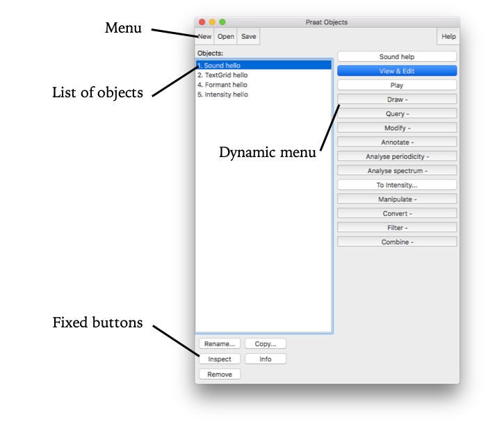
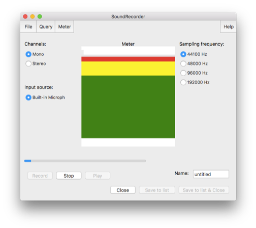
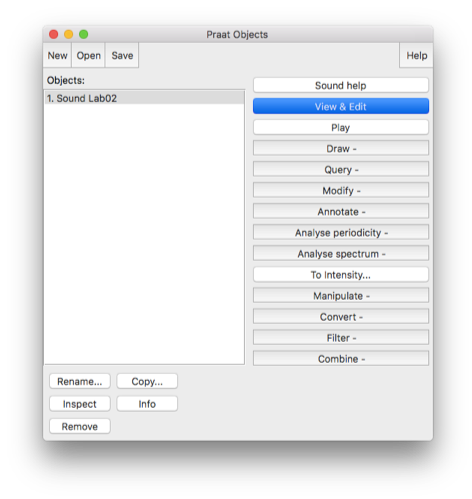
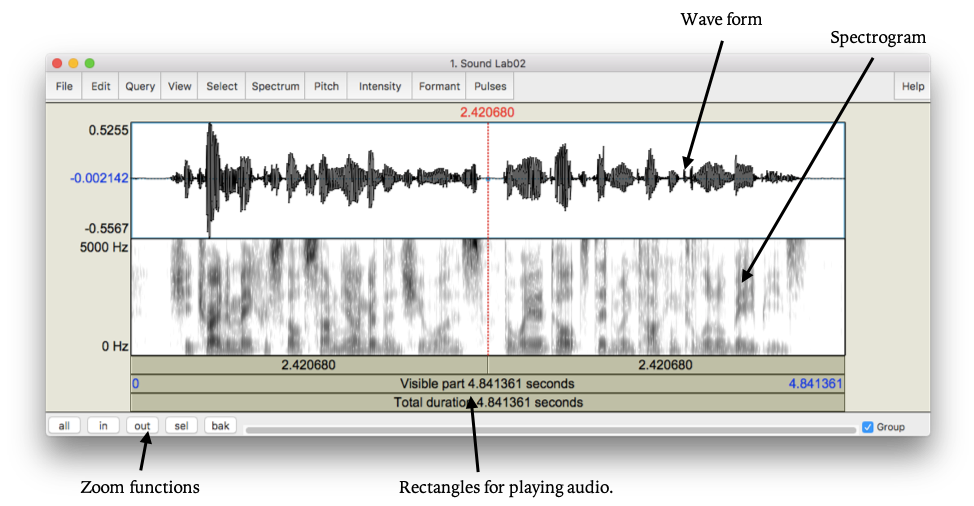
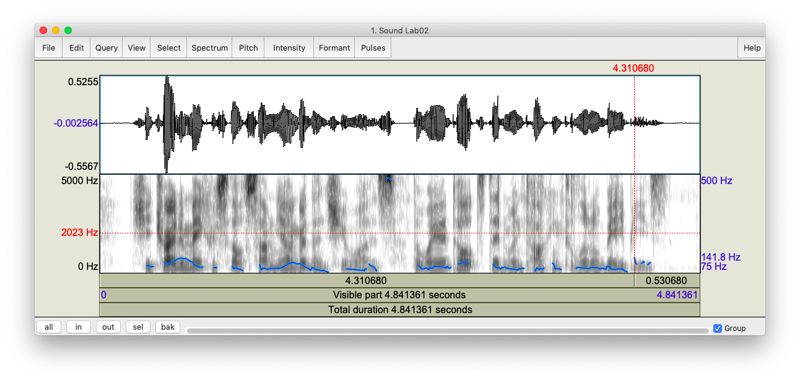
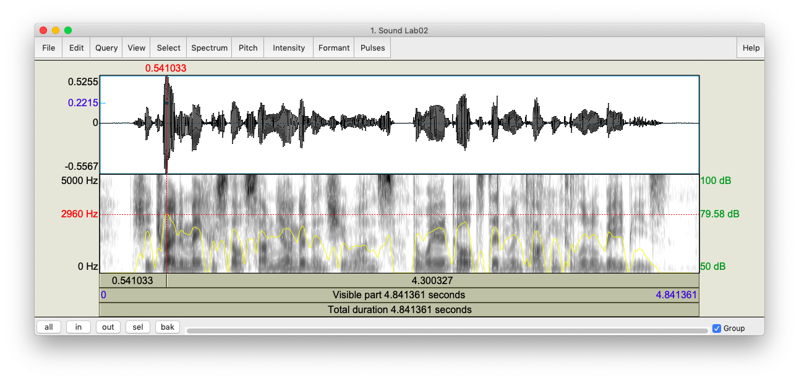
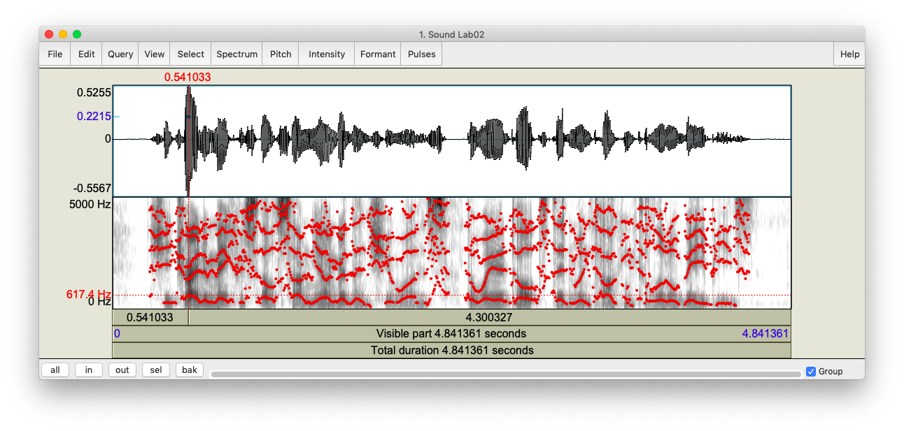
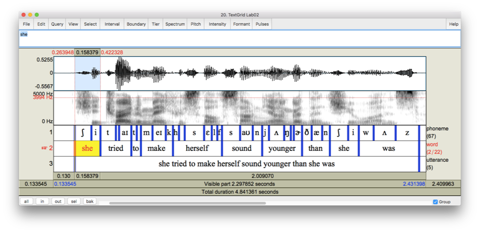

```{r setup, include=FALSE}
knitr::opts_chunk$set(echo = TRUE, fig.align = "centered")
```

This is the first workshop in the *2019 Praat Scripting Workshop Series*, offered at the University of Georgia DigiLab. For more information about the series and for links to the other handouts, visit [joeystanley.com/praat](http://joeystanley.com/pages/praat-workshops)

# Introduction

Praat (Dutch for "talk") is a free computer software package for the scientific analysis of speech and phonetics. Written and maintained by Paul Boersma and David Weenick, Praat has tons of features and can do a very wide range of functions for processing speech. In this workshop series, we can only show you how to do a very small number of things because we don't even know all the ins and outs of Praat, but hopefully you'll be able to leave the workshop with some skills yourself.

I'll be the first to say that Praat definitely has some negative aspects: 

1. Praat is not the most visually appealing program. The icon, which is supposed to look like an ear and lips, probably hasn't changed since the 90's when the software was first created. 

1. It is also not the most intuitive software. Everything is hidden behind menus and buttons and everything takes a lot of clicks. 

1. It's not the easiest software to learn how to use. The documentation online is very brief and never has enough detail. There are no books on how to use Praat. And---this one still boggles my mind---no one has written a decent tutorial. There is help within the software itself, but it's not easy to use. This is part of the reason we wanted to put together these workshops, with a detailed set of instructions, so that you can use it to your advantage in your own research.

1. In the past, Praat has been notoriously unstable. It would often crash without warning, meaning you'd lose all your work. There is no autosave feature. Recent versions seem more stable, but there's always a small chance of it crashing. 

With that said, Praat is still a highly sophisticated piece of software under-the-hood. There are some definite pros for using Praat:

1. It's the standard. Nearly every linguist has used Praat at some point. This is especially true of phoneticians, phonologists, and sociolinguists.

1. While the software itself may not be pretty, the visualizations it can produce are professional quality.

1. It actually has its own scripting language, to help automate any function it can do. This is especially useful if you have a task that you need to do over and over. Say you have a recording half an hour long and you want to extract the duration of all the vowels---a script will take care of that in seconds. But Praat scripting is even more of a black box than the regular software, with even fewer tutorials online. I can't teach everything about Praat scripting in this class, but I hope to introduce a few basic tools. 

1. It's free. 

The pros outweigh the cons for sure.

## Installing Praat

Praat is available at praat.org and can run on a variety of operating systems. To install it, simply go to [praat.org](http://praat.org) and at the upper left of the site, click on your computer's operating system. The program is relatively small and simple to run. To open Praat, click on its icon like any other program on your computer. 

## Praat Basics

When you first open Praat, there will be two windows that appear. The one on the right is where visualizations will occur. For now, we don't need to worry about it, and you can just close it. 



The window on the left is called the **object window**. It is where your Praat **objects** will appear. Praat objects can be of many different types, such as Sound, TextGrid, or Formant (we'll get to these later). Strictly speaking these are contained in your computer's memory and are not automatically saved. This means that if Praat crashes, everything in your object window is lost. So save often! 

The menu is *relatively* straightforward. I say that because while the basic functions are clear, I am not familiar with most of the options in each of these menus. Here are what each of the menu items do and the ones I use:

1. `New`: This is where you can create new objects from scratch, such as recording a mono or stereo sound. I have never needed to use any of the other options and submenus in this menu. 

1. `Open`: This is where you can load files already stored on your computer, such as a recording downloaded from the internet or some other Praat-specific file you've created in the past. While Praat can handle pretty long sound files, but they take up a lot of memory. So if you're working with a sound file longer than a couple minutes, it might be better to open it as a **LongSound** file. 

1. `Save`: This menu allows you to save files in one of many formats, depending on the kind of Praat object. I almost always save audio as a WAV file and everything else as a text file. 

As you can see, there are many other options, just in creating, loading, and saving files, but these basic options will serve you just fine. 

Moving down the objects window, next is the list of objects. This is where you can see the names of the Praat objects currently in memory. As mentioned previously, these objects can take several forms, and Figure 1 above showed just four of them: `Sound`, `TextGrid`, `Formant`, and `Intensity`. For each object, the objects window displays what kind of object it is, followed by its name. In this case, object number 1 is a "Sound"" that is named "hello". 

At the bottom of the objects window you will find the **fixed buttons**. These are "fixed" because they are always there and available, regardless of what is in the list of objects. The utility of the `Rename`, `Copy`, and `Remove` buttons is self-explanatory, and the `Inspect` and `Info` buttons show various properties and information about the selected objects. 

Finally, on the right side of the window we see the **dynamic menu**. This side will display buttons for many functions available to whatever Praat object(s) is/are selected. Some things can be performed on Sound files, other are only done on `TextGrids`. We'll get into what these functions do in a later workshop

# Working with Audio

## Making a Recording

Without further ado, let's make a recording directly in Praat. You can open the **SoundRecorder window** by following this command:

```
New > Record mono Sound... 
```

Here you'll see the basic window for recording sound directly into Praat. Depending on your operating system, you may see different options, but the general layout is the same. You can change it to a stereo sound if you have a stereo microphone, but I always use mono to save on disk space. If you have an external microphone plugged in, you can use that for recording. Otherwise, you can use the one that's built into your computer. On the right, you can set your sampling frequency. For most speech, it's sufficient to set it at 44,100 Hz, but if you want to set it higher (I guess if you're recording bats??) you can set it to much higher. The smaller sampling frequency will result in a smaller file size.



When you hit the `record` button, it'll display a visual cue of how loud it is in the main center box. You want to stay within the green: if it's too soft you can always amplify the sound later. Anything in the red means the sound has been clipped which can't be fixed. When you are done, hit `stop`. At this point, be careful because it's easy to lose the recording. For example, if you hit `record` again, you'll lose it all and you can't get it back. Right now, it's a good idea to save the file. You can save your new recording to the objects window, but it's probably best to save it to your computer too, which can be done in the File menu in the Sound Recorder window. 

Go ahead and record yourself saying the following sentence:

> "She tried to make herself sound younger than she was, the way adults did when talking to little babies."

Alternatively, if you do not have access to a microphone, you may download some sample recordings from some interviews I've done at [joeystanley.com/data/sample_audio.zip](http://joeystanley.com/data/sample_audio.zip). After unzipping the file, to open one of them in Praat, go to 

```
Open > Read from file… 
```

in the objects window.

A couple things to know about recording in Praat. First, Praat has a recording buffer. By default, it's 20 megabytes, meaning it'll cut you off once the recording takes up that much memory. Audio recorded in stereo or with larger sampling frequencies will eat up more of this memory quicker. You can change this cap by going to this menu

```
Praat > Preferences > Sound recording preferences...
```

and setting it to a larger buffer. I don't do very much recording in Praat (I use some other free software called *Audacity*), but it's nice to know how to in case you need it for smaller things. Also, for those who want to know, Praat records with a 16-bit audio depth, which is about the quality of an audio CD.

When you're ready, go ahead and give your recording a name, and save it to the objects window (`Save to list`) and close the SoundRecorder window. Or, you can do this all in one step with `Save to list & Close`. 

## Sound objects

Now that you have a Sound file open and selected in Praat, you'll see lots of options of things you can do in the dynamic menu (Figure 2). Before we get there, let's make sure we save our sound so we don't have to rerecord it. In the menu at the top of the objects window, save it with this command:

```
Save > Save as WAV file…
```

Choose where you'd like to save this file. 



Now we can start looking at the different options in the dynamic menu.

1. `Sound help`: Here, you can see all sorts of help pages relating to Sound files. 

1. `View & Edit`: This opens up the SoundEditor window. We'll get to that below.

1. `Play`: Click this and the sound will play.

1. `Draw`: This is where you produce and export visuals.

1. `Query`: This menu button has lot of submenus that let you extract information from your audio such as how long it is, the time where the sound it at its loudest, and lots of other information. We'll learn about these in later session.

1. `Modify`: Here is where you can make global changes to the audio: make it louder, turn it backwards, override the sampling frequency, etc.

1. `Annotate`: This menu allows you to create a `TextGrid`, which allows annotation of the `Sound` file. We'll get to that later in this workshop.

1. `Analyse periodicity`: This allows you to extract things like the pitch or signal-to-noise ratio from the audio and analyze them separately.

1. `Analyse spectrum`: Among other options, this menu allows you to extract and analyze just the formant values in the audio, which is useful for studying vowels.

1. `To Intensity…`: This extracts just the intensity (=loudness) of the audio and lets you get information from it.

1. `Manipulate`: This lets you modify parts of audio like the intonation or vowel formants to create a synthesized modification of the audio.

1. `Convert`: Here is where you can convert stereo to mono, extract portions of the sound, or do pitch alternation.

1. `Filter`: This menu allows for filtering out low or high sounds. For very noisy recordings or audio that was recorded on bad equipment, this might help the clarity.

1. `Combine`: If you have multiple recordings you want to either overlay on top of each other or concatenate them, you do that here.

As you can see, there are a *lot* of options for Sound files. After all, Praat is primarily a tool for analyzing audio. In later workshops, we will use some of these tools, but the majority serve very specific purposes that we don't have time to get into in this series. Luckily, there are some tutorials on each one of these online, though they can be a little hard to follow.

## The SoundEditor window

For now, let's see how Praat visualizes the sound. After highlighting the Sound file, click `View & Edit` to open the SoundEditor window. Figure 4 (next page) shows the main components of this new window. Taking up the majority of the space are two visualizations: the wave form and the spectrogram. For both of these, the *x*-axis, represents time. So the beginning of the audio is at the far left and the end is at the far right.



The wave form represents the actual sound wave. When the black portion of the wave form is taller, it's louder, while smaller ones are quieter. In fact, if you zoom far enough in, you can see that the black shapes become just a single line moving up and down, which represents the sound wave. On the left of the wave form, the numbers at the top and bottom of the *y*-axis of the wave form ($0.5255$ and $-0.5567$) represent the signal-to-noise (SNR) ratio, which ranges from 0 to 1. The blue number is the SNR measurement at the point where the curser is. Higher numbers usually indicate cleaner audio. 

Parallel to the wave form is the spectrogram, which is a different way of viewing sound. The spectrogram breaks down the speech signal into its component frequencies using what's called a Fourier (="furrier") transformation. All you need to know for now is that the top represents higher frequencies while the bottom is lower frequencies. A trained phonetician can actually "read" a spectrogram and know what is being said. If you click on the spectrogram, a red number appears to the left showing the frequency in Hertz (Hz) at that point.

To play portions of the audio, use the rectangles below the spectrogram. In addition to providing information about the duration of each one, if you click on them they'll play that portion. To start playing somewhere in the middle, just click on the wave form or the spectrogram where you want to start and the rectangles will update. To select a smaller portion of the audio to play, just click and drag and highlight a section.

To change the view, you can zoom in and out with the zoom buttons at the bottom left. You can zoom out to see the whole file (`all`), or just zoom in (`in`) or out (`out`). If you highlight a section of audio, you can zoom to just that selection (`sel`). You can also go back to your previous view (`bak`). If you have lateral scrolling on your computer, after you zoom in you can move side to side with that.

At the bottom right is the `Group` checkbox. If you have multiple SoundEditors with the same audio in them (for example, with different `TextGrid` files), if this box is checked, when you scroll, all windows will scroll in tandem. If you want them to scroll independently, uncheck this box.

Across the top of the SoundEditor window, there are even more menu options, some of which overlap with the dynamic menu options for Sound files we saw earlier:

1. `File`: Here you can save the audio to your computer, extract portions of it, or save the visualizations.

1. `Edit`: Here you can copy and paste portions of audio.

1. `Query`: This lets you extract information such as the exact time the curser is at.

1. `View`: This has more specific zoom and playing options.

1. `Select`: This lets you move the cursor to specific times.

1. `Spectrum`: Here you can change some of the settings for how the spectrogram is displayed.

1. `Pitch`: This helps you analyze the pitch of the audio, which is very helpful for those studying intonation and tone. You can display the pitch overlaid on the spectrogram, find the minimum and maximum pitch in a selection, and extract just the pitch contour for visualizations.

1. `Intensity`: Similar to pitch, this includes options to overlay the intensity contour as well as options for extracting that information

1. `Formant`: This is another similar menu item, which displays formant measurements and options for extracting them. This is very handy for studying vowels.

1. `Pulses`: If you want to study creaky voice, this menu has options for displaying and extracting information about pulses in the vocal folds. 

## Manual Acoustic Measurements 

Praat is designed to do far more than simply viewing and annotating audio recordings. Among the many, many things it can do, some of them are easily accessible in the SoundEditor window.

### Pitch

The first is to view the pitch of speaker's voice. You can turn this on by clicking

```
Pitch > Show pitch
```

This will overlay a blue line on the spectrogram showing the pitch at that time point. It'll also add a secondary legend to the right side of the spectrogram showing an approximate range of pitch values in the visible portion of the audio.



In this example, since it's my voice, the pitch is somewhere between 80 and 140 Hz. Something you'll notice about Praat's pitch tracker is that sometimes it goofs up a little bit. You can see an exmaple of this about midway through the recording, during the /s/ of the word *was*. There, Praat thinks the pitch is somewhere close to 500Hz, which would be a high falsetto for me. Obviously it's not because that's during the fricative. 

If you want to find the exact pitch, you can. At the point where my curser is located in the above plot (about 4.31s into the recording) is the point where the pitch is at its maximum (disregarding the messed up portion). An easy way to tell what the pitch is at that point is to look at the right hand side---141.8 Hz. Another way is to go to 

```
Pitch > Get pitch
```

A new window will pop up, the **Praat Info** window, and will give you a *very* specific pitch estimate.

#### Your Turn! {- .tabset}

##### The problem {-}

How do I know that the point that was selected was indeed the location of the maximum pitch? Explore the options in the `Pitch` menu and see if you can figure out how.

##### The solution {-}

The key to finding the point where the maximum pitch is located is this function:

```
Pitch > Move cursor to maximum pitch
```

In order for this to work though, you'll need to highlight a selection of audio. For this particular recording, if I highlight the whole thing, it'll tell me that the point with the highest pitch is 2.328s into the audio, right where the fricative is. That's the error, so I want to ignore that. So to get around it, I highlighted the first half up to the fricative, found the maximum pitch (139.9Hz at 0.659s, during the word *tried*) and compared it to the maximum pitch in the second half after the fricative. 

Now that we're done with pitch, go ahead and turn it off the same way to turned it on.

### Intensity

Another acoustic measure that we can extract right now is the intensity (amplitude, volume, etc.) of the recording at a paraticular time point. Just as easily as we did with Pitch, we can turn on the intensity information with

```
Intensity > Show intensity
```

This will display a yellow line overlayed on the spectrogram, with green numbers along the right axis showing intensity measured in decibels. 



The types of commands you can with intensity are similar to those with pitch. You can find out the pitch at any time point by clicking on that spot in the spectrogram and viewing the value along the right axis. Alternatively, you can click

```
Intensity > Get intensity
```

As far as I can tell, there's no way to identify the point of maximum intensity like you can with pitch, but the point on the figure above is pretty close: 79.58 dB at 541ms into the recording (during the word *tried*). 

### Formants

The last acoustic measure we'll extract manually today are formant estimates. Recall that formants are frequencies that resonate particularly strongly as a result of the tongue's position in the mouth creating resonating chambers. They're key to differentiating vowels. Now, one important thing to keep in mind is that the numbers we extract here are just *estimates*. In the future, you'll see how to tweak the settings and you'll find that the measurements change. As always, estimation can be prone to error, but the better the sound quality, the more confident you can be about your data. For this reason, it's good to get the best quality audio you can while minimizing background noise.

To view formant estimations, you can turn them on like you did with pitch and intensity:

```
Formant > Show formants
```



This will display formant contours, drawn as red speckles. This time, the estimated measurement at the point where the cursor is is on the left, since it's on the same Hz scale as the spectrogram itself. Right off the bat, we can extract some of these formant estimations in a similar way that we did the pitch and intensity. You can just put your cursor wherever you want, and it'll show the value on the left (in the example above, it's at approximately 617 Hz). 

An important thing to note is that the value you see on the left is not necessarily the estimated formant measurement: it's simply how high within the spectrogram I clicked. You can see this by clicking around arbitrarily in the spectrogram and you'll see the red number change. This is an important feature because it allows you to take *manual* measurements of formants, regardless of what Praat has estimated. The issue with this method is that it's slow and essentially impossible to replicate because of its subjectivity. However, it's a good feature to be aware of.

Instead, what you may want to do is to rely on Praat's estimated values. To extract just the lowest formant, F1, which corresponds to the height of the vowel, you can click on a timepoint and do this:

```
Formant > Get first formant
```

As always, it's worth the time to learn the keyboard shortcuts. In this case, you can do the same thing by hitting F1. A window will pop up that shows you what the formant estimation is. You could do the same thing indivually for F2, F3, and F4, but it might be easier to just click

```
Formant > Formant listing
```

instead, which will give you all of them at once. It's in a probably-poorly formatted table, but this can be easily copied over into Excel if you want.

Now, I mentioned before that you can change Praat's parameters for formant extraction. Not only *can* you, but you actually *should*. People's vocal tracts are different lengths, and you can get better estimates if you adjust the settings appropriately. To adjust the formant parameters, go to:

```
Formant > Formant settings...
```

The main two parameters that you might want to change are these:

* *Maximum formant (Hz)*: By default, Praat will look for formants that are less than 5000Hz, which is the default for a male voice. For female voices, it's recommended to switch this to 5500 Hz. For very deep voices, I've had success switching to 4500Hz and for very high voices, I've done 6000Hz. Generally, I've seen people increment this parameter by 5000Hz, but you're welcome to use whatever number you want (5250Hz, 5100Hz, 5837Hz, whatever).

* *Number of formants*: Within the range that you specify, Praat looks for five formants by default, F1 through F5. You can change this too, but you may want to adjust the max Hz accordingly. For male voices, I've had success using 4 formants at 4000Hz, but that was a judgement call on my part.

There are other parameters you can adjust as well, but I'll let you explore those on your own.

#### Your Turn! {- .tabset}

##### The Problem {-}

Adjust the formant parameters and look at the effect that it has on the red dots. Zoom in on a high front vowel, a low vowel, and a back vowel and see how well the various parameters do. Take actual measurements and see how they differ, even if the dots don't move that much.

##### The Solution {-}

In my recording, I found a token of /i/ in the word *she* and put the cursor near the midpoint. At 5000Hz and 5 formants, F1 was at 285Hz and F2 was 2001Hz. When I switched to 4 formants and 4000Hz, F1 was hardly any different (286Hz) but F2 was a bit lower (1986Hz). This may not seem like a big difference, but after many tokens, a 15Hz difference can adjust the overall results a little bit. Since /i/ has such a high F2 and F3, it's good to experiment a little bit to make sure the formant tracker gets those two correct.

I then went to the word *talking* for the /ɔ/ token. With the default settings, F1 was 635Hz and F2 was 1056Hz. When I switched to 4000Hz and 4 formants, F1 was 633Hz and F2 was the same. In this case, it didn't change much. However, when I switched to the default for women's voices (5500Hz and 5 formants), F1 was quite a bit higher at 683Hz and F2 was 1048Hz. As you can see, making these methodological choices is important because they can have outcomes on your results!

For /u/, this sentence happened to not have any /u/, /ʊ/, or /o/ strangely enough. However, keep in mind that /u/ has a high F1 and a low F2, so Praat often interprets the two as a single formant. That will take some additional adjusting to make sure Praat gets both of them.


# Working with Transcriptions

## TextGrid Objects

Usually, analyzing audio by itself isn't very productive. For one thing, it's hard to tell where you are in the audio. For this one sentence, it's not too big of a deal, but for a 30-minute recording, it gets cumbersome to have to scroll around trying to find things. 

For this reason, there are TextGrid objects. Before explaining the underlying mechanics of how these work, it might make more sense just to see one. 



When we view both the Sound file with its TextGrid, we can see how they line up. The waveform and the spectrogram are displayed like before, only underneath those now we have various **tiers** of text. In this example above, I have three tiers: "phoneme," "word," and "utterance" which is a catch-all for sentence or breath group. Each tier can have any number of **boundaries**, which are represented by the blue vertical lines. These boundaries delimit the **intervals** in the tier. It is in these intervals that you can type transcription, annotations, or whatever other text you want. 

When you click on an interval, it turns yellow with red background. The accompanying portion of the audio is also highlighted. Finally, the text is displayed in the text editor above the wave form but below the menu items. It is here that you can edit the text. Note that since this is a speech analysis software, it is perfectly capable of working with foreign and unusual characters, as you can see with the IPA characters in the first tier. 

Many of the commands that were seen for sound files can also be found here as you view both a `Sound` and a `TextGrid` object at the same time. You can play, zoom, and highlight portions of the audio and `TextGrid`. There are a few new commands in the menu: 

1. `Interval`: This menu allows you to add new intervals to the `TextGrid` file. These commands come with keyboard shortcuts, so it's usually easier to use those instead. 

1. `Boundary`: Very similar to the Interval menu, this allows you to add individual boundaries to whatever tier you want. 

1. `Tier`: This lets you add, duplicate, rename, or remove tiers from the `TextGrid`. 

It is usually easier to view `TextGrid`s and `Sound` files at the same time. 

## Creating and working with TextGrids

It is possible to create a `TextGrid` from scratch, but it's usually better to create one that accompanies a `Sound` file. To create a new `TextGrid`, highlight the `Sound` file in the Praat Objects window and follow these commands:

```
Annotate > To TextGrid...
```

In the "Sound: To TextGrid" window, there are two boxes for input. In "All tier names:" delete the default text ("Mary John bell") and type "phoneme word sentence". This will create three tiers, one called "phoneme," one called "word," and one called "sentence." Where it says "Which of these are point tiers?", you can ignore that for now. That's used for studying intonation, which we won't cover in this series (unfortunately). Hit "OK" and you should see your new TextGrid object in your Praat Objects windows. Highlight both of them and then click "View & Edit" to open the TextGrid editor like we saw above.

*Adding intervals and boundaries*: When you open a brand new TextGrid, there obviously will not be anything in them. To add boundaries, click somewhere in the audio and follow this command:

```
Interval > Add interval on tier 1
```

Alternatively, I'd recommend using the keyboard shortcut: Ctrl/Command + 1. You'll now see a blue vertical bar on the top tier aligned with the point in the audio you clicked. Go ahead and add an interval on tier 2 and tier 3 as well.

*Deleting boundaries*: To delete a boundary, click on it---it will appear as red and yellow if it is selected---and follow this command:

```
Boundary > Remove
```

Or you can follow the keyboard shortcut: Alt + Backspace.

*Moving boundaries*: To move a boundary, simply click on it and drag from left to right. If you have boundaries on multiple tiers that are aligned, you can move them together by holding Shift while dragging.  

*Playing intervals*: Once you have several boundaries, the space between them (the intervals) will contain portions of audio. You can play just that portion of audio by clicking the interval and hitting the Tab key. Alternatively, you can click the rectangle below the corresponding portion of the audio and play it as well.

*Saving TextGrids*: Be sure to save often! All the work you do in Praat is not saved automatically. Even when you're done, you must explicitly save your TextGrid or else your work will be lost. To save a TextGrid, close the Sound Editor window, highlight the TextGrid in the Praat Objects window, and follow this command:

```
Save > Save as text file... 
```

# Your Turn!

The rest of the workshop is for you to explore Praat and to get used to transcribing audio. In later workshops, we'll see how to automate this process, but it's healthy to do it by hand at least a little bit to better appreciate how much Praat is doing for you. Spend some time transcribing your audio at the word level and phoneme level. On the word tier, each word should be in its own interval. On the phoneme tier, each phoneme gets its own interval. You can use IPA characters to represent phonemes if you'd like. You are not expected to produce a perfect transcription of your English phonemes. See Figure 5 (above) for an example of what this should look like.

Hint: It might be easier to transcribe the sentence on a piece of paper first, then write it out on the computer in some word processing software. Then, segment out your audio, and copy and paste the symbols in.

# Next Time

In the next workshop, we will dive right into Praat scripting. We'll learn how to automatically extract information from TextGrids, and how to process multiple files at once. After that (in October), we'll write a script that'll extract formant measurements from vowels. Finally, in November, we'll extract VOT from the consonants in the recording. 
