This handout is meant to accompany the Praat workshop that I gave to the Voice and Speech Teachers Association (VASTA) on July 25, 2026. The goal for this workshop is to introduce the fundamentals of Praat for voice and speech professionals who have little or no prior experience with the software. In this handout, I'll cover how the acoustic correlates of elements of speech like pitch, vowel quality, and voice quality are represented visually. I hope that you'll be able to walk away with some practical skills for exploring and understanding speech. At the end, I'll show some tools that I've recently developed that may be helpful for you that relate to this.

## The basics

<!--Lightly edited and updated from the 2019 workshop. -->

Praat (Dutch for "talk") is a free computer software package for the scientific analysis of speech and phonetics. Written and maintained by Paul Boersma and David Weenick, Praat has tons of features and can do a very wide range of functions for processing speech. Recently, Anastasia Shchupak has joined as co-author and is involved in AI tools like transcription. Of the many things that Praat can do, I can only show a small portion of them. Hopefully I've selected a set of features that'll be useful for you.

I'll be the first to say that Praat definitely has some negative aspects: 

1. Praat is not the most visually appealing program. The icon, which is supposed to look like an ear and lips, probably hasn't changed since the 90's when the software was first created. 

1. It is also not the most intuitive software. Everything is hidden behind menus and buttons and everything takes a lot of clicks. 

1. It's not the easiest software to learn how to use. The documentation online can be brief and never seems to has enough detail. There are no books on how to use Praat. There are tutorials but they're scattered and often are aimed at performing specific tasks. There is help within the software itself, but it's not easy to use. 

1. In the past, Praat has been unstable. It would often crash without warning, meaning you'd lose all your work. There is no autosave feature. Recent versions seem more stable, but there's always a small chance of it crashing. 

With that said, Praat is still a highly sophisticated piece of software under-the-hood. There are some definite pros for using Praat:

1. It's the standard. Nearly every linguist has used Praat at some point. People in allied fields who study speech likely hav as well.

1. While the software itself may not be pretty, the visualizations it can produce are professional quality.

1. It actually has its own scripting language, to help automate any function it can do. This is especially useful if you have a task that you need to do over and over. Unfortunately, I can't show how to script here, but there are tutorials online, including my own. See @sec-additional-resources for links to those.

1. It's free. 

The pros outweigh the cons for sure.

### Download and installation

<!--Lightly edited and updated from the 2019 workshop. -->

Praat is available at praat.org and can run on a variety of operating systems. To install it, simply go to [praat.org](http://praat.org) and at the upper left of the site, click on your computer's operating system. The program is relatively small and simple to run. To open Praat, click on its icon like any other program on your computer. 

:::{.callout-tip}
Make sure you have Praat installed before moving ahead!
:::

### The Praat interface

<!--Lightly edited and updated from the 2019 workshop. -->

When you first open Praat, there will be two windows that appear. One will have a pink rectangle and is where visualizations will occur. For now, we don't need to worry about it, and you can just close it. 

The other window is your home base for Praat (@fig-objects_window). It's called the **object window** and is where your Praat **objects** will appear. Praat objects can be of many different types, such as Sound, TextGrid, or Formant (we'll get to these later). Strictly speaking these are contained in your computer's memory and are not automatically saved. This means that if Praat crashes, everything in your object window is lost. So save often! 

{#fig-objects_window}

The menu is *relatively* straightforward. I say that because while the basic functions are clear, I am not familiar with most of the options in each of these menus. Here are what each of the menu items do and the ones I use:

1. `New`: This is where you can create new objects from scratch, such as recording a mono or stereo sound. I have never needed to use any of the other options and submenus in this menu. 

1. `Open`: This is where you can load files already stored on your computer, such as a recording downloaded from the internet or some other Praat-specific file you've created in the past. While Praat can handle pretty long sound files, but they take up a lot of memory. So if you're working with a sound file longer than a couple minutes, it might be better to open it as a **LongSound** file. 

1. `Save`: This menu allows you to save files in one of many formats, depending on the kind of Praat object. I almost always save audio as a WAV file and everything else as a text file. 

As you can see, there are many other options, just in creating, loading, and saving files, but these basic options will serve you just fine. 

Moving down the objects window, next is the list of objects. This is where you can see the names of the Praat objects currently in memory. As mentioned previously, these objects can take several forms, and Figure 1 above showed just four of them: `Sound`, `TextGrid`, `Formant`, and `Intensity`. For each object, the objects window displays what kind of object it is, followed by its name. In this case, object number 1 is a "Sound" object that is named "hello". 

At the bottom of the objects window you will find the **fixed buttons**. These are "fixed" because they are always there and available, regardless of what is in the list of objects. The utility of the `Rename`, `Copy`, and `Remove` buttons is self-explanatory, and the `Inspect` and `Info` buttons show various properties and information about the selected objects. 

Finally, on the right side of the window we see the **dynamic menu**. This side will display buttons for many functions available to whatever Praat object(s) is/are selected. Some things can be performed on Sound files, other are only done on `TextGrids`. We'll get into what these functions do later.

## Working with Sound

Now that we've got some preliminaries out of the way, the first main portion of this workshop will be to work with audio in Praat. We'll move on to transcriptions (using Praat TextGrids) in @sec-transcription_objects.

### Making a recording

Let's make a recording directly in Praat. You will more likely be loading in your own audio when you use Praat for real-life applications, but it's good to see how it's done. Open the **SoundRecorder window** by following this command:

```
New > Record mono Sound... 
```

Here you'll see the basic window for recording sound directly into Praat (@fig-sound_recorder_window). Depending on your operating system, you may see different options, but the general layout is the same. You can change it to a stereo sound if you have a stereo microphone, but I always use mono to save on disk space. If you have an external microphone plugged in, you can use that for recording. Otherwise, you can use the one that's built into your computer. On the right, you can set your sampling frequency. For most speech, it's sufficient to set it at 44,100 Hz, but if you want to set it higher (I guess if you're recording bats??) you can set it to much higher. The smaller sampling frequency will result in a smaller file size.

{#fig-sound_recorder_window}

When you hit the `record` button, it'll display a visual cue of how loud it is in the main center box. You want to stay within the green: if it's too soft you can always amplify the sound later. Anything in the red means the sound has been clipped which can't be fixed. When you are done, hit `stop`. At this point, be careful because it's easy to lose the recording. For example, if you hit `record` again, you'll lose it all and you can't get it back. Right now, it's a good idea to save the file (see below).

Go ahead and record yourself saying something. Here is a sentence you can try if you can't come up with anything short.

> "She tried to make herself sound younger than she was, the way adults did when talking to little babies."

A couple things to know about recording in Praat. First, Praat has a recording buffer. By default, it's 20 megabytes, meaning it'll cut you off once the recording takes up that much memory. Audio recorded in stereo or with larger sampling frequencies will eat up more of this memory quicker. You can change this cap by going to this menu

```
Praat > Preferences > Sound recording preferences...
```

and setting it to a larger buffer. I don't do very much recording in Praat (I mostly use another free software called *Audacity* if I need to record from my computer directly), but it's nice to know how to in case you need it for smaller things. Also, for those who want to know, Praat records with a 16-bit audio depth, which is about the quality of an audio CD.

When you're ready, go ahead and give your recording a name, and save it to the objects window (`Save to list`) and close the SoundRecorder window. Or, you can do this all in one step with `Save to list & Close`. 

### Saving a recording

Any audio file you have in Praat can be saved. In fact, as mentioned above, you should save often since Praat doesn't have any sort of auto-save feature. To save an audio file, go to:

```
File > Save as WAV file…
```

From there, you can navigate to a place on your computer where you want to save the file. Praat sometimes doesn't automatically add file extensions (the `.wav` at the end of the filename), so you'll want to make sure it's there and type it in yourself if it's now. 

:::{.callout-note}
You may know this already, but WAV files are among the best kind to work with when dealing with audio. Some filetypes like mp3s compress the audio by removing information that it things humans won't notice. When working with Praat, we want the full uncompressed audio type. Making sure you deal only with WAV files if you can is the way to go.
:::

### Opening an existing file

If you would like to open an audio file that already exists in your computer, you can do so by following this command:

```
Open > Read from file… 
```

in the objects window. Notice that Praat has another option, 

```
Open > Open Long Sound file…
```

This is useful for when you want to load in, as you might guess, a long sound file. I don't know if there's a clear definition of what a "long" sound file is, and it probably depends on your computer. But generally for me, if I'm working with something that's more than a few minutes long, I'll open it as a Long Sound file. The difference between them is what Praat stores into your computer's short term memory. For a regular Sound file (opened using `Read from file`), Praat will store the entire thing into your computer's memory. That can eat up a lot of processing power if it's a big file. Opening a Long Sound means Praat will only load in what it needs at a time, rather than the whole thing. If you load a Sound file and you notice Praat being a big laggy, try `Remove`ing the file and reloading it as a Long Sound file. 


:::{.callout-tip}
You'll get the most out of this workshop if you have an audio file to work with. Pause here and make sure you have sound. If you do not have access to a microphone right now but would like to follow along still, you may download some sample recordings from some interviews I've done at [joeystanley.com/data/sample_audio.zip](http://joeystanley.com/data/sample_audio.zip). 
:::

### Sound objects

Now that you have a Sound file open and selected in Praat, you'll see lots of options of things you can do in the dynamic menu (@fig-options_sound_object).

{#fig-options_sound_object}

Let's look at the different options in the dynamic menu.

1. `Sound help`: Here, you can see all sorts of help pages relating to Sound files. 

1. `View & Edit`: This opens up the SoundEditor window. We'll get to that below.

1. `Play`: Click this and the sound will play. Don't click this if your file is longer than a few seconds!

1. `Draw`: This is where you produce and export visuals. 

1. `Query`: This menu button has lot of submenus that let you extract information from your audio such as how long it is, the time where the sound it at its loudest, and lots of other information. 

1. `Modify`: Here is where you can make global changes to the audio: make it louder, turn it backwards, override the sampling frequency, etc.

1. `Annotate`: This menu allows you to create a `TextGrid`, which allows annotation of the `Sound` file. We'll get to that later in this workshop.

1. `Analyse periodicity`: This allows you to extract things like the pitch or signal-to-noise ratio from the audio and analyze them separately.

1. `Analyse spectrum`: Among other options, this menu allows you to extract and analyze just the formant values in the audio, which is useful for studying vowels.

1. `To Intensity…`: This extracts just the intensity (=loudness) of the audio and lets you get information from it.

1. `Manipulate`: This lets you modify parts of audio like the intonation or vowel formants to create a synthesized modification of the audio.

1. `Convert`: Here is where you can convert stereo to mono, extract portions of the sound, or do pitch alternation.

1. `Filter`: This menu allows for filtering out low or high sounds. For very noisy recordings or audio that was recorded on bad equipment, this might help the clarity.

1. `Combine`: If you have multiple recordings you want to either overlay on top of each other or concatenate them, you do that here.

As you can see, there are a *lot* of options for Sound files. After all, Praat is primarily a tool for analyzing audio. In this workshop, we will use some of these tools, but the majority serve very specific purposes that we don't have time to get into today. There are some tutorials on some of these online, though they are often geared towards advanced linguistics students.

### The SoundEditor window

For now, let's see how Praat visualizes the sound. After highlighting the Sound file, click `View & Edit` to open the SoundEditor window. @fig-sound_editor_window shows the main components of this new window. Taking up the majority of the space are two visualizations: the waveform and the spectrogram. For both of these, the *x*-axis, represents time. So the beginning of the audio is at the far left and the end is at the far right.

:::{.column-screen}
{#fig-sound_editor_window}
:::

The waveform represents the actual sound wave. When the black portion of the wave form is taller, it's louder, while smaller ones are quieter. In fact, if you zoom far enough in, you can see that the black shapes become just a single line moving up and down, which represents the sound wave. On the left of the wave form, the numbers at the top and bottom of the *y*-axis of the wave form ($0.5255$ and $-0.5567$) represent the signal-to-noise (SNR) ratio, which ranges from 0 to 1. The blue number is the SNR measurement at the point where the cursor is. Higher numbers usually indicate cleaner audio, unless it's a 1 in which case almost certainly means the audio was clipped.

Parallel to and below the waveform is the spectrogram, which is a different way of viewing sound. The spectrogram breaks down the speech signal into its component frequencies using what's called a Fourier transformation. All you need to know for now is that the top represents higher frequencies while the bottom is lower frequencies. A trained phonetician can actually "read" a spectrogram and know what is being said. If you click on the spectrogram, a red number appears to the left showing the frequency in Hertz (Hz) at that point.

To play portions of the audio, use the rectangles below the spectrogram. In addition to providing information about the duration of each one, if you click on them they'll play that portion. To start playing somewhere in the middle, just click on the wave form or the spectrogram where you want to start and the rectangles will update. To select a smaller portion of the audio to play, just click and drag and highlight a section.

To change the view, you can zoom in and out with the zoom buttons at the bottom left. You can zoom out to see the whole file (`all`), or just zoom in (`in`) or out (`out`). If you highlight a section of audio, you can zoom to just that selection (`sel`). You can also go back to your previous view (`bak`). If you have lateral scrolling on your computer, after you zoom in you can move side to side with that.

At the bottom right is the `Group` checkbox. If you have multiple SoundEditor windows with the same audio in them (for example, with different `TextGrid` files), if this box is checked, when you scroll, all windows will scroll in tandem. If you want them to scroll independently, uncheck this box.

Across the top of the SoundEditor window, there are even more menu options, some of which overlap with the dynamic menu options for Sound files we saw earlier:

1. `File`: Here you can save the audio to your computer, extract portions of it, or save the visualizations.

1. `Edit`: Here you can copy and paste portions of audio.

1. `Query`: This lets you extract information such as the exact time the curser is at.

1. `View`: This has more specific zoom and playing options.

1. `Select`: This lets you move the cursor to specific times.

1. `Spectrum`: Here you can change some of the settings for how the spectrogram is displayed.

1. `Pitch`: This helps you analyze the pitch of the audio, which is very helpful for those studying intonation and tone. You can display the pitch overlaid on the spectrogram, find the minimum and maximum pitch in a selection, and extract just the pitch contour for visualizations.

1. `Intensity`: Similar to pitch, this includes options to overlay the intensity contour as well as options for extracting that information

1. `Formant`: This is another similar menu item, which displays formant measurements and options for extracting them. This is very handy for studying vowels.

1. `Pulses`: If you want to study creaky voice, this menu has options for displaying and extracting information about pulses in the vocal folds. 

We'll spend most of the rest of the time in this workshop in this SoundEditor window, once we add a transcription to it.


## Working with transcriptions {#sec-transcription_objects}

Unless you're *really* good at reading a spectrogram, you'll likely want a transcription to accompany your Sound file. In the short term, this makes it a lot easier to figure out where you are in the file, especially for long files. But down the road you might find it helpful for other reasons too. Let's see how Praat works with transcriptions. 


## TextGrid Objects

Transcriptions in Praat are accomplished using TextGrid files. Before explaining the underlying mechanics of how these work, it might make more sense just to see one. Take a look at @fig-sound_with_textgrid.

:::{.column-screen}
{#fig-sound_with_textgrid}
:::

When we view both the Sound file with its TextGrid, we can see how they line up. The waveform and the spectrogram are displayed like before, only underneath those now we have various **tiers** of text. In this example above, I have three tiers: "phoneme," "word," and "utterance", the last being a catch-all for "sentence" or "breath group". Each tier can have any number of **boundaries**, which are represented by the blue vertical lines. These boundaries delimit the **intervals** in the tier. It is in these intervals that you can type transcription, annotations, or whatever other text you want. 

When you click on an interval, it turns yellow with red background. The accompanying portion of the audio is also highlighted. Finally, the text is displayed in the text editor above the wave form but below the menu items. It is here that you can edit the text. Note that since this is a speech analysis software, it is perfectly capable of working with foreign and unusual characters, as you can see with the IPA characters in the first tier. 

Many of the commands that were seen for sound files can also be found here as you view both a `Sound` and a `TextGrid` object at the same time. You can play, zoom, and highlight portions of the audio and `TextGrid`. There are a few new commands in the menu: 

1. `Interval`: This menu allows you to add new intervals to the `TextGrid` file. These commands come with keyboard shortcuts, so it's usually easier to use those instead. 

1. `Boundary`: Very similar to the Interval menu, this allows you to add individual boundaries to whatever tier you want. 

1. `Tier`: This lets you add, duplicate, rename, or remove tiers from the `TextGrid`. 

It is usually easier to view `TextGrid`s and `Sound` files at the same time. 

### Creating a TextGrid

So, let's make a TextGrid. To create a new `TextGrid` that accompanies a Sound file, highlight the `Sound` file in the Praat Objects window (you may need to close the View & Edit window to see the Praat Objects window) and follow these commands:

```
Annotate > To TextGrid...
```

In the "Sound: To TextGrid" window, there are two boxes for input. In "All tier names:" delete the default text ("Mary John bell") and type "phoneme word sentence". This will create three tiers, one called "phoneme," one called "word," and one called "sentence." Where it says "Which of these are point tiers?", make sure that's blank. (That's used for in-depth analysis of intonation, which we won't cover in this workshop.) Hit "OK" and you should see your new TextGrid object in your Praat Objects windows. Highlight both of them and then click "View & Edit" to open the TextGrid editor like we saw above.

### Working with TextGrids

*Adding intervals and boundaries*: When you open a brand new TextGrid, there will not be anything in any of the tiers. To add boundaries, click somewhere in the audio and follow this command:

```
Interval > Add interval on tier 1
```

I'd recommend using the keyboard shortcut: Ctrl/Command + 1. You'll now see a blue vertical bar on the top tier aligned with the point in the audio you clicked. Go ahead and add an interval on tier 2 and tier 3 as well.

*Deleting boundaries*: To delete a boundary, click on it---it will appear as red and yellow if it is selected---and follow this command:

```
Boundary > Remove
```

Or you can follow the keyboard shortcut: Alt + Backspace.

*Moving boundaries*: To move a boundary, simply click on it and drag from left to right. If you have boundaries on multiple tiers that are aligned, you can move them together by holding Shift while dragging.  

*Playing intervals*: Once you have several boundaries, the space between them (the intervals) will contain portions of audio. You can play just that portion of audio by clicking the interval and hitting the Tab key. Alternatively, you can click the rectangle below the corresponding portion of the audio and play it as well.

*Saving TextGrids*: Be sure to save often! All the work you do in Praat is not saved automatically. Even when you're done, you must explicitly save your TextGrid or else your work will be lost. To save a TextGrid, close the Sound Editor window, highlight the TextGrid in the Praat Objects window, and follow this command:

```
Save > Save as text file... 
```

If Praat doesn't add it for you, ensure that you add `.TextGrid` to the filename to ensure that it gets saved properly and so that Praat knows how to open it afterwards. 


<!--TODO: Different ways of making TextGrids Modifying an automated TextGrid (TextGrid silences). -->


## Use cases

In this section, I'll demonstrate some of the specific things you can do with Praat. As I do so, I'll keep certain questions in mind that you may have about your audio. I'll start by seeing how you can work with pitch, in case you have questions about or want to visualize intonation. I'll then move on to glottal pulses, which is good if you want to analyze creaky voice or other voice qualities. I'll then talk about formants, which can be helpful when looking at vowels. We'll then look at plosive consonants by examining voice onset time (VOT). We'll end with looking at sibilant consonants by examining center of gravity. 

In each section, I'll present some of the basic Praat functionality including how to extract certain acoustic measurements. We'll briefly see how to visualize each one. I'll also discuss a little bit about the phonetics of each phenomena that might aid your interpretatio of what you're seeting. 


### Pitch

First, we'll examine the pitch of speaker's voice. This is useful if you want to look at intonation or tone (depending on the language). Unfortunately, intonation is notoriously difficult to study and pin down, so I really won't be able to show much more than simple visualizations and measurements.

#### Visualizing pitch

Praat can approximate pitch by estimating how often the speaker's vocal folds are vibrating at any point during your recording. To view these estimates, open a Sound file, either by itself or together with a TextGrid. I'll use this recording of myself:

<audio controls>
  <source src="audio/joey.wav">
</audio>


Once you've got that loaded into Praat, turn on the pitch visualizer by going to

```
Pitch > Show pitch
```

This will overlay a blue line on the spectrogram showing the pitch at that time point. It'll also add a secondary legend to the right side of the spectrogram showing an approximate range of pitch values in the visible portion of the audio. See @fig-pitch_overlay.

:::{.column-screen}
{#fig-pitch_overlay}
:::


In this sample of my voice, the pitch is somewhere between 80 and 140 Hz. It's a little hard to see the contour though because the pitch range is relatively narrow compared to the full range of 50--800Hz that it can show. Let's adjust the Pitch settings a little bit by zooming in a little bit on that range. Go to

```
Pitch > Pitch settings (filtered autocorrelation)…
```

A new window will pop up with a whole bunch of options. We don't need to worry about all of them. The one we want to adjust are the first two: the Pitch floor and top. You should see `50.0` and `800.0`. Since we know the pitch range in the recording is only between about 80 and 140 Hz, let's zoom in to closer to that range. I'll try from 70 to 160Hz. Here's what that should look like now (@fig-pitch_settings).

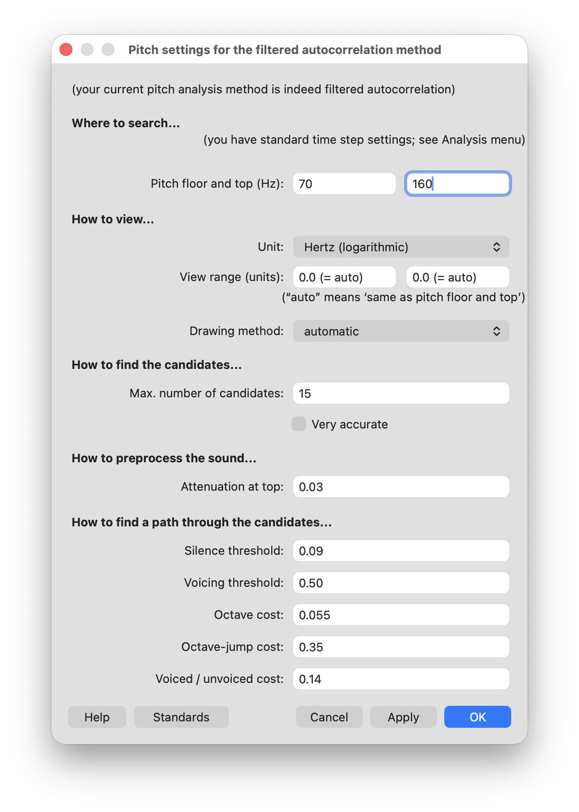{#fig-pitch_settings width="65%"}

That's the only change we need to make to this window. If you can see this window and your spectrogram at the same time, try clicking on `Apply` as you watch the blue line. (In Praat, `Apply` changes the settings and keeps the window open while `OK` changes the settings and closes the window.) You should notice the blue line is now more spread out vertically since we've zoomed into that range (@fig-pitch_overlay_adjusted).

:::{.column-screen}
{#fig-pitch_overlay_adjusted}
:::

:::{.callout-tip title="Pitch Exercise 1"}

If that's a little too zoomed in, you can try zooming out a little, perhaps add another 100Hz or so to the top end. Play with it until you get something that looks good. 

:::


:::{.callout-note}

There are several algorithms that Praat can use to estimate pitch. In 2023, it switched to the method that we're using now, the filtered autocorrelation method. The specifics of these methods are not important to beginning users, but you can read about them [here](https://www.fon.hum.uva.nl/praat/manual/how_to_choose_a_pitch_analysis_method.html). 

Since adopting this newer technique, Praat's pitch tracker has been much better. Previously, Praat's pitch tracker sometimes it goofs up a little bit. In @fig-pitch_old_method, I've switched it to the older method, the raw cross-correlation algorithm.

{#fig-pitch_old_method}

You can see right near the middle of the sentence, there is a pitch measurement that is super high, right at the top center of the spectrogram. (This happened during the /s/ of the word *was*.) There, Praat thinks the pitch is somewhere close to 500Hz, which would be a high falsetto for me. It's clearly not a good measurement because /s/ is a voiceless sound and shouldn't even have any pitch measurements. The newer method avoids these erroneous measurements. Unless you have a reason to continue with an older method for comparison purposes, I'd recommend sticking to the default, which is the filtered autocorrelation method.

:::

#### Measuring pitch

If you want to find the exact pitch at any point, you can. At the point where my cursor is located in @fig-pitch_overlay (about 6.666 seconds into the recording) is the point where the pitch is at its maximum. An easy way to tell what the pitch is at that point is to look at the right hand side---139.7 Hz. Another way to get this exact pitch is to click on the point along the blue pitch contour that you want to measure and go to

```
Pitch > Get pitch
```

A new window will pop up, the **Praat Info** window, and will give you a *very* specific pitch estimate (@fig-pitch_measurement).

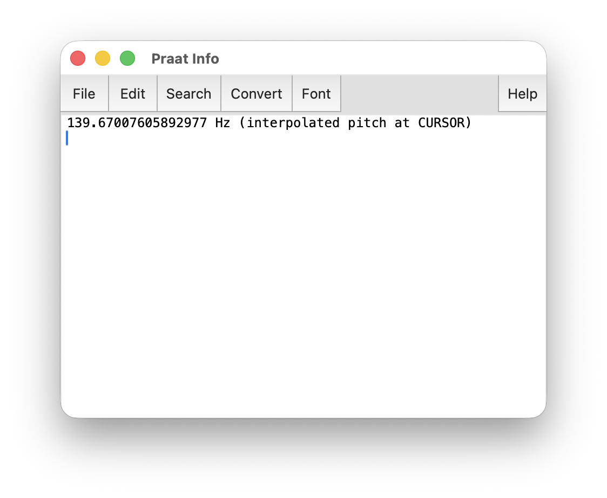{#fig-pitch_measurement width="65%"}
I don't know why Praat's measurements have so many decimal places, but I guess it's better than not having enough!


:::{.callout-tip title="Pitch Exercise 2"}

Take a few minutes and see if you can work with pitch by yourself. Here is a problem to solve. Try to figure it out before you click on the solution.

:::{.panel-tabset}

##### The problem {.unnumbered}

I know that the point that was selected in @fig-pitch_overlay is indeed the location of the maximum pitch. How can you find the precise moment of the highest pitch in your recording? Explore the options in the `Pitch` menu and see if you can figure out how.

##### The solution {.unnumbered}

The key to finding the point where the maximum pitch is located is this function:

```
Pitch > Move cursor to maximum pitch
```

In order for this to work though, you'll need to highlight a range of audio instead of just a single point. For this particular recording, if I highlight the whole thing, it'll tell me that the point with the highest pitch is 2.328s into the audio, right where that bad measurement in /s/ is. That's the error, so I want to ignore that. So to get around it, I highlighted the first half up to the fricative, found the maximum pitch (139.9Hz) and compared it to the maximum pitch in the second half after the fricative. 

:::

:::


<!--TODO

#### Spectrogram settings

15000 Hz instead of 5000Hz. Window length to 0.025 for pitch movemements.

-->


#### Visualizing the pitch overlay

It may be helpful to produce a high quality image with that blue overlay. In this section, we'll look at how to create visualizations in Praat. Much of what we'll learn in this section is transferable to other sections when we learn about visualizations. So, bear with me at first as we do it for the first time. If you follow along the entire tutorial, you'll revisit this a handful of times. 

Since the spectrogram isn't important here, we can hide it. Go to

```
Spectogram > Show spectrogram
```

and uncheck the box. You should now have an unencumbered look at the pitch contour. However, it's a little *too* devoid of context, so I'll load in the TextGrid so we can see how the contours line up with the words. @fig-pitch_without_spectrogram shows what that looks like. 

:::{.column-screen}
{#fig-pitch_without_spectrogram width="90%"}
:::

At this point, a lot of people just take a screenshot of Praat and call it good. But we can do better. 

Remember that window we closed when we opened Praat? The one with the pink rectangle? It's time to use that. (Don't worry, we'll make it pop up again automatically.) Go to 

```
Pitch > Draw visible pitch contour…
```

which is close to the bottom of the `Pitch` menu.

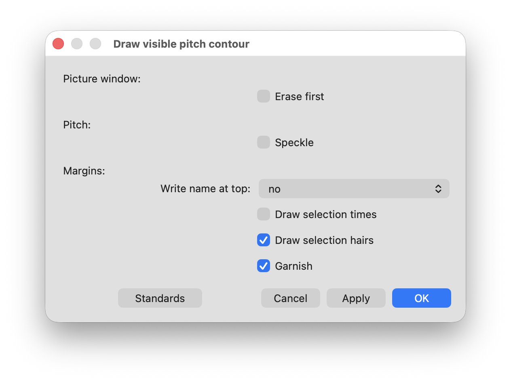{#fig-pitch_draw_window}

Fow now, we can accept the default settings. Go ahead and click `Apply` and you should see a window that looks like this:

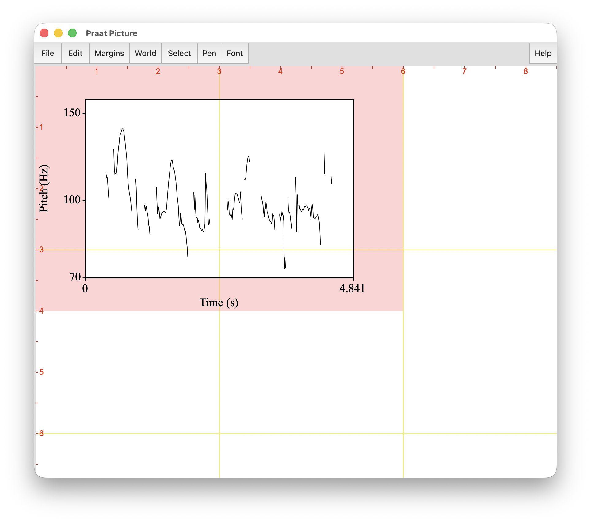{#fig-pitch_picture_basic}

Here we see the **Praat Picture Window** for the first time in action. Hopefully you can now see what that pink rectangle does. The area inside of it defines the area that the thing you want to draw---in this case, the pitch contour. If you'd like it to be bigger, go back to the **Praat Picture Window** and click and drag and you should see the pink rectangle change size. For me, I'd like it a little bit wider. Once you're satisfied with a size, you back to the **Draw visible pitch contour window** (or, if you closed out of it, go to `Pitch > Draw visible pitch contour…`), make sure the `Erase first` box is checked, and then hit `Apply` again, and you should see your image update. 

:::{.callout-tip title="Pitch Exercise 3"}
Spend a minute or so and play around with the other settings in the **Draw visible pitch contour window**. What do each of the following do?

* Erase first
* Speckle
* Write name at top: no, far, and near
* Draw selection times
* Draw selection hairs
* Garnish

Figure out the combination of settings that you're satisfied with.

:::

You can export this image in a high-quality image format. In the **Praat Picture Window**, go to one of these two options

```
File > Save as PDF file…
File > Save as 300-dpi PNG file…
```

(You can of course explore the others if you'd like, but these are probably the most common). Save the file to your computer and check it out to make sure it looks the way you want. 

#### Adding a TextGrid to the pitch visual

A visualization of a pitch contour by itself is not super helpful since there is no context. Fortunately, Praat has a built-in function that lets you visualize the pitch contour *and* the TextGrid at the same time. Go back to your TextGrid window and go to:

```
TextGrid > Draw visible pitch contour and TextGrid
```

That'll take you to a new window that has many of the same options. Erase what you have so far but otherwise the default settings and seeing what it looks like. 

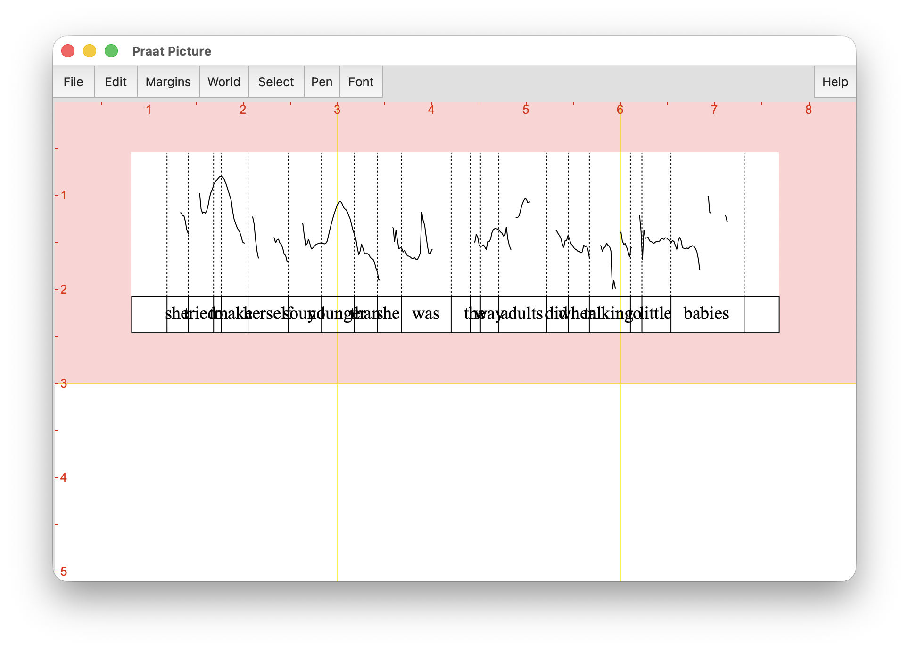{#fig-pitch_textgrid_messy}

If you have too much audio selected, you may find (like in @fig-pitch_textgrid_messy) that it's a bit messy. The words are all on top of each other. There's just too much that it's trying to squeeze into a single window. Let's zoom into a smaller range of the audio, perhaps just a few seconds, or rather, a single intonational contour, and visualize that. Notice that Praat's command is called Draw *visible* pitch contour and TextGrid. So we need to actually zoom in in the TextGrid window and then visualize that. 

:::{.panel-tabset}

##### The zoomed in TextGrid {.unnumbered}

Here's the portion of the TextGrid that I zoomed into.

:::{.column-screen}
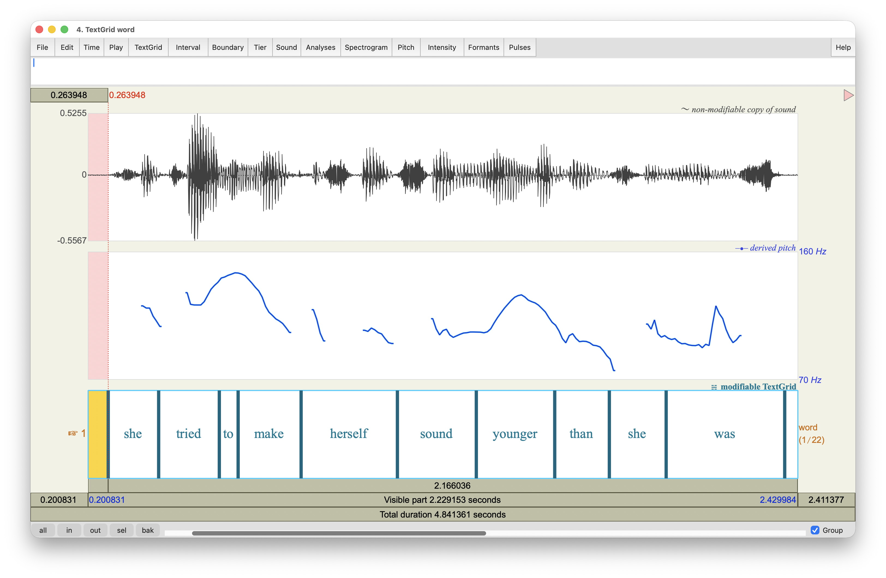{width="90%"}
:::

##### The Praat drawing {.unnumbered}

Here's the drawing itself in the **Praat Picture** window. Notice that I checked the `Garnish` box to get some of that additional detail. 

:::{.column-screen}
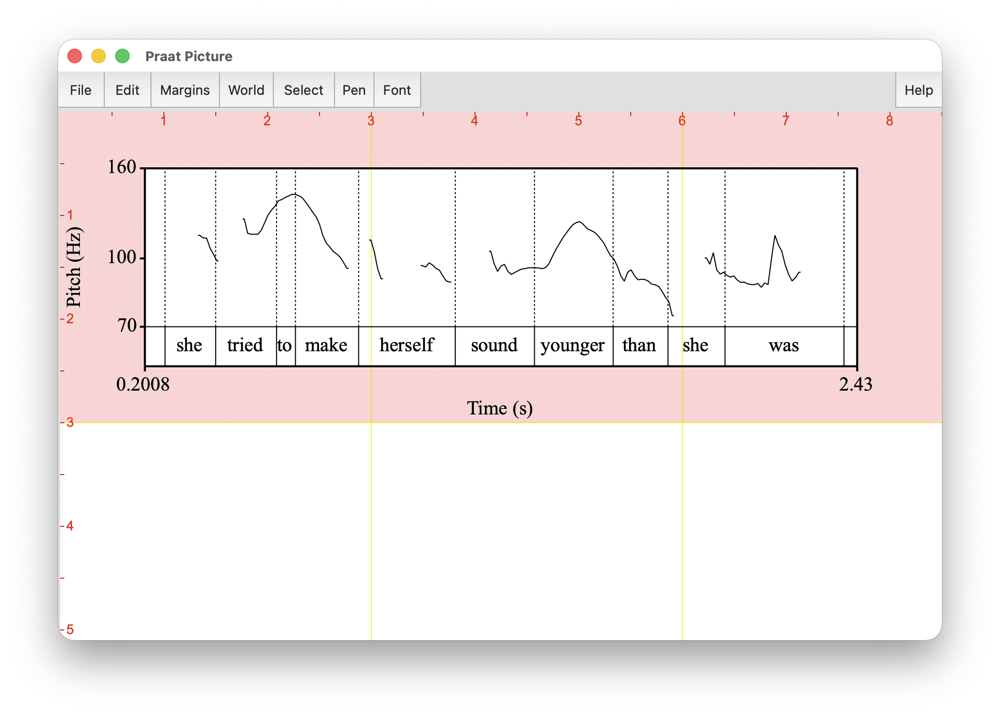{width="90%"}
:::

##### The resulting figure {.unnumbered}

Here's what the image file looks like when I export it. 

:::{.column-screen}
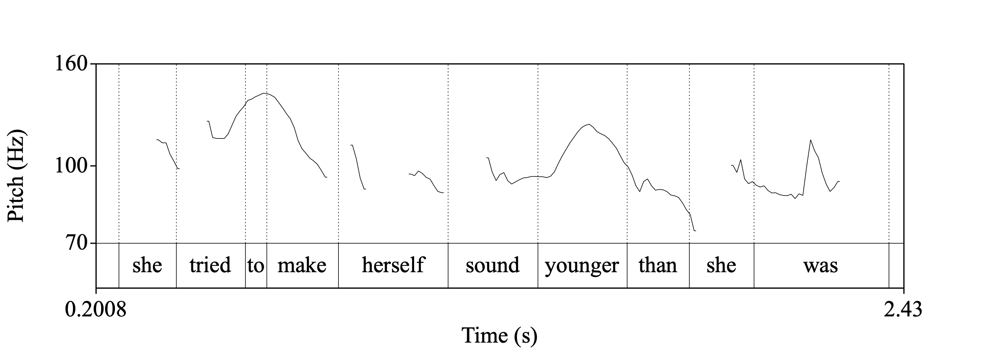{width="90%"}
:::

:::

So that's it for pitch for now! In this section, we've covered how to extract some basic pitch measurements and how to visualize pitch, both by itself and with an accompanying TextGrid. In the next section we'll shift our attention to voice quality. Now that we're done with pitch, go to the TextGrid window, then go to `Pitch`, and uncheck the `Show Pitch` box. 


<!-- TODO

### Pulses

Voice quality includes things like breathy voice, creaky voice (i.e. vocal fry), harsh voice, and a whole bunch of other kinds of laryngeal settings. Each of these is complex and multifaceted and we definitely don't have the time to examine even one of them in the depth it deserves. Instead, I'll focus on a few acoustic measurements and visualizations that we can get from Praat, primarily using the options within the `Pulses` menu item. 


Voice report

Creaky voice. 

Jitter = variance in pitch, shimmer = variance in amplitude.

Other voice quality? (Harmonics?)


-->


### Formants

The next acoustic measure that we'll extract manually is formant estimates. You may know that formants are frequencies that resonate particularly strongly in the mouth as a result of the tongue's position in the mouth creating resonating chambers. Vowels and other vowel-like sounds (like /ɹ/ and /l/) have formant frequencies. Experimental work has shown that the first three formants are particularly important for identifying vowel sounds. In fact, the vowel trapezoid that you might be familiar with from an IPA chart are based directly on the first two formant frequencies. @fig-my_vowel_space is a plot of my formant measurements plotted as a scatterplot. 

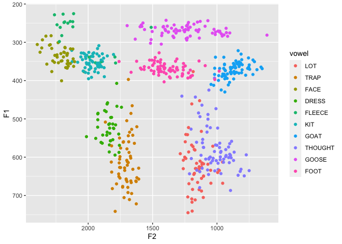{#fig-my_vowel_space}

One important thing to keep in mind is that the numbers we extract here are just *estimates*. As we dive into the settings of formants, you'll see how tweaking the parameters will cause the measurements change. As always, estimation can be prone to error, but the better the sound quality, the more confident you can be about your data. For this reason, it's good to get the best quality audio you can while minimizing background noise.

To view formant estimations, you can turn them on like you did with pitch and intensity:

```
Formant > Show formants
```


This will display formant contours, drawn as red and pink speckles. Odd numbered formant measurements (F1, F3, F5) are in red and even numbered ones (F2, F4) are in pink. The estimated measurement in Hz at the point where the cursor is is on the left, since it's on the same Hz scale as the spectrogram itself. Right off the bat, we can extract some of these formant estimations in a similar way that we did the pitch and intensity. You can just put your cursor wherever you want, and it'll show the value on the left (in the example above, it's at approximately 617 Hz). 

An important thing to note is that the value you see on the left is not necessarily the estimated formant measurement: it's simply how high within the spectrogram I clicked. You can see this by clicking around arbitrarily in the spectrogram and you'll see the red number change. This is an important feature because it allows you to take *manual* measurements of formants, regardless of what Praat has estimated. The issue with this method is that it's slow and essentially impossible to replicate because of its subjectivity. However, it's a good feature to be aware of.

Instead, what you may want to do is to rely on Praat's estimated values rather than clicking close to it. To extract just the lowest formant, F1, which corresponds to the height of the vowel, click where in the recording you want the measurement (i.e. where horizontally, which corresponds to time), and then go to

```
Formant > Get first formant
```

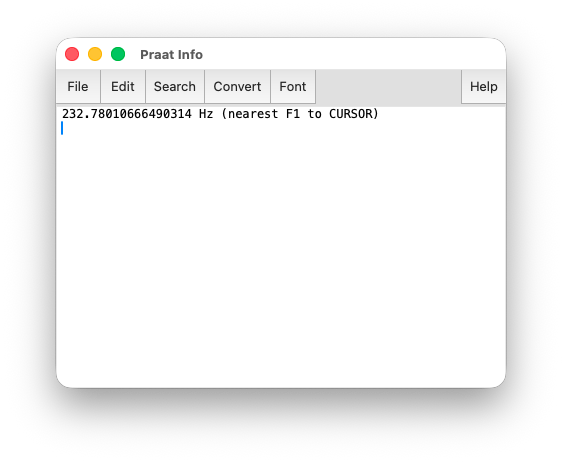{width="65%"}

As always, it's worth the time to learn the keyboard shortcuts. In this case, you can do the same thing by hitting F1. A window will pop up that shows you what the formant estimation is. You could do the same thing individually for F2, F3, and F4, but it might be easier to just click

```
Formant > Formant listing
```

instead, which will give you all of them at once. It's in a probably-poorly formatted table, but this can be easily copied over into Excel if you want.


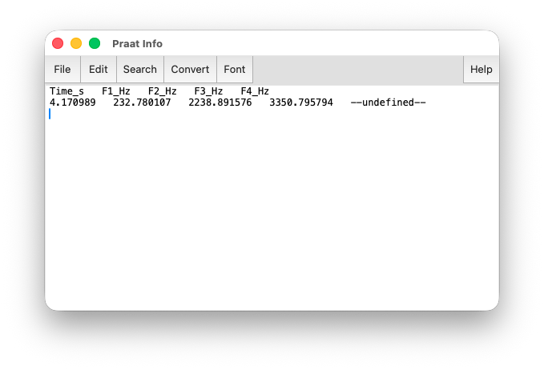{width="65%"}

Now, I mentioned before that you can change Praat's parameters for formant extraction. Not only *can* you, but you actually *should*. People's vocal tracts are different lengths, and you can get better estimates if you adjust the settings appropriately. To adjust the formant parameters, go to:

```
Formant > Formant settings...
```

You'll be presented with a window that looks like this:

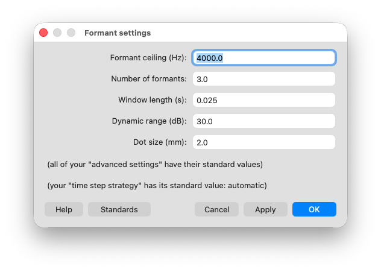{width="65%"}

The main two parameters that you might want to change are these:

* *Formant ceiling (Hz)*: By default, Praat will look for formants that are less than 5500Hz, which is the default for a female voice. For male voices, it's recommended to switch this to 5000 Hz. For very deep voices, I've had success switching to 4500Hz and for very high voices, I've done 6000Hz. Generally, I've seen people increment this parameter by 500Hz, but you're welcome to use whatever number you want (5250Hz, 5100Hz, 5837Hz, whatever).

* *Number of formants*: Within the range that you specify, Praat looks for five formants by default, F1 through F5. You can change this too, but you may want to adjust the max Hz accordingly. For male voices, I've had success using 4 formants at 4000Hz, but that was a judgement call on my part.

If you can see both the `Formant settings` window and the `TextGrid` window at the same time, click on `Apply` and watch the red speckles adjust according to the parameters. The goal is to get the red speckles to align with the dark horizontal bands on the spectrogram as closely as possible. Consider this trio of images

:::{.panel-tabset}

##### No formant estimates

This image shows a spectrogram of me saying the word *bed*. This version doesn't have the red speckles because I want you to notice the roughly four horizontal bands going across the vowel. That's what we want our red speckles to align with. In this case, the formants are relatively level, meaning they don't move up or down across the duration of the vowel, which makes it easier to get the red speckles to align. 

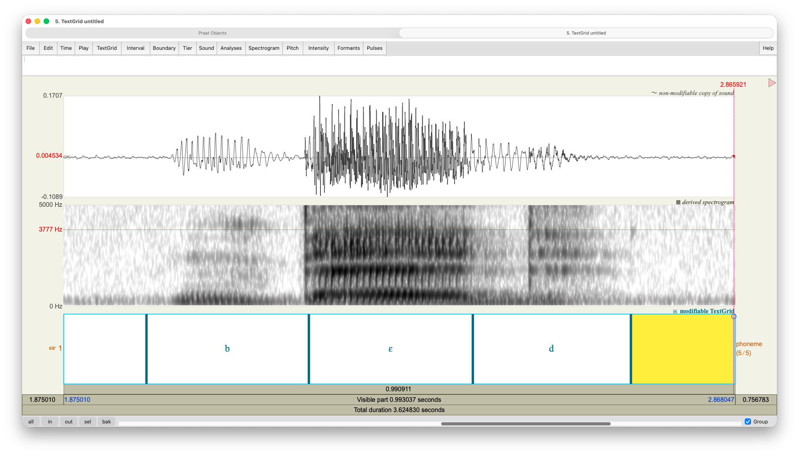


##### Good formant estimates

In this version of the plot, I've used appropriate settings, a formant ceiling of 4500Hz and four formants. Notice that in the vowel portion of the recording, the red speckles align nicely with the horizontal bands. This produces pretty good estimates of the /ɛ/ vowel. Extending into the consonants, the formant estimates look a little messy, but we don't care about those, so it's no big deal.


##### Bad formant estimates

In this version of the plot, I've told Praat to look for five formants under 4000 Hz. Some of the red speckles look alright, but crucially, in the  middle of the vowel we have a sort of phantom formant that Praat thinks it found. There is a short stretch of pink speckles between the lowest two formants. Since Praat was forced to look for five in a relatively narrow window (0--4000Hz), an extra one was thrown in there. 

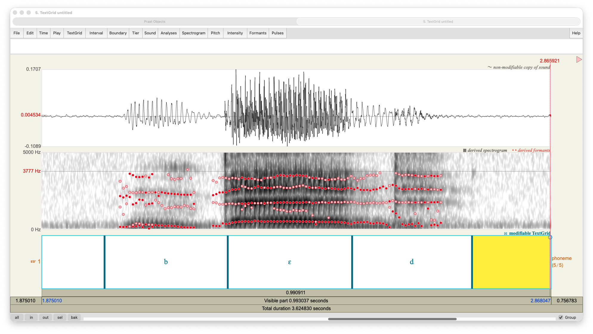

:::


:::{.callout-tip title="Formant Exercise 1"}

:::{.panel-tabset}

##### The task {.unnumbered}

Adjust the formant parameters and look at the effect that it has on the red dots. Zoom in on <sc>fleece</sc>, <sc>thought</sc>, and <sc>goose</sc> vowels and see how well the various parameters do. Take actual measurements and see how they differ, even if the dots don't move that much.

##### A solution {.unnumbered}

In my recording, I found a <sc>fleece</sc> vowel in the word *she* and put the cursor near the midpoint. At 5000Hz and 5 formants, F1 was at 285Hz and F2 was 2001Hz. When I switched to 4 formants and 4000Hz, F1 was hardly any different (286Hz) but F2 was a bit lower (1986Hz). This may not seem like a big difference, but after many tokens, a 15Hz difference can adjust the overall results a little bit. Since /i/ has such a high F2 and F3, it's good to experiment a little bit to make sure the formant tracker gets those two correct.

I then went to the word *talking* for the /ɔ/ token. With the default settings, F1 was 635Hz and F2 was 1056Hz. When I switched to 4000Hz and 4 formants, F1 was 633Hz and F2 was the same. In this case, it didn't change much. However, when I switched to the default for women's voices (5500Hz and 5 formants), F1 was quite a bit higher at 683Hz and F2 was 1048Hz. As you can see, making these methodological choices is important because they can have outcomes on your results!

For /u/, this sentence happened to not have any /u/, /ʊ/, or /o/ strangely enough. However, keep in mind that /u/ has a high F1 and a low F2, so Praat often interprets the two as a single formant. That will take some additional adjusting to make sure Praat gets both of them.

:::

:::


:::{.callout-tip title="Formant Exercise 2"}

If you are interested in plotting your own vowels, it can be a fun exercise to manually extract formant measurements and creating a scatterplot. To do this, you'll want to make a recording of yourself saying all the English vowels. 

Since some consonants (like /j/, /w/, /l/, /ɹ/, and nasals) can influence formants, it's best to pick words that have the vowel at the end of the word, or before voiced stops (/b/, /d/, /ɡ/), fricatives (/v/, /ð/, /z/, /ʒ/), or affricates (/dʒ/). You can try a set of words like *bead*, *bid*, *bade*, *bed*, *bad*, *pod*, *pawed*, *bud*, *bode*, *hood*, *booed* or something like that. If you have the time, you can get multiple instances of the same vowel (*bee*-*heed*-*ease*, *bid*-*dig*-*iz*, *stay*-*age*-*daze*, etc.) so that you can see a cluster.

For each word, find the temporal middle of the vowel. By that, I mean try to click right in the midpoint between the end of the previous consonant (if any) and the start of the next consonant (if any). Here is an example of me saying *bed* with my cursor right in the middle of the vowel. (You don't need a TextGrid to do this task, but I have one here for demonstration purposes.)

Alternatively, you can pick a portion of the vowel that is relatively steady. In the image of the word *bed* above, the formants were relatively stable. Diphthongs like <sc>price</sc>, <sc>mouth</sc>, and <sc>choice</sc> will likely involve some formant movement. Even monophthongs like <sc>face</sc> and <sc>goat</sc> will as well. Other vowels may involve some formant movement as well depending on the vowel, dialect, and surrounding consonants. In vowels that involve formant movement, you may need to extract formants near the beginning and near the end and then in your vowel plot draw an arrow to connect the two. 

Find the F1 and F2 of each vowel and save that information into a spreadsheet. Using Excel or other software, you can then make a scatterplot. You'll want to put F2 on the *x*-axis and F1 on the *y*-axis. You'll also need to flip the direction of both axes so that the origin is on the top right corner rather that the top left. You could also plot it out by hand on graph paper. You could also use [this online tool](https://adamb924.github.io/formant-plot/). Unfortunately, it's outside the scope of this workshop to show you how to make this plot. 

:::


There are some things to consider when looking at formant measurements. 

1. Everyone's vocal tracts are different, so there is no "correct" formant measurement for any vowel for any dialect. Taller people often have longer vocal tracts, so they tend to have lower formants since longer things create lower sounds (think of bass guitars, saxophones, or pipe organs). The opposite is true for shorter people. And there are of course other factors that go into a person's formant measurements. So, if you get someone's formant measurement and it's very different from your own, that's fine. When it comes to formants, it's all about their position relative to others rather than the exact measurements.

1. Extracting formants is error-prone. For one, try clicking in the same place twice and notice the red number above the spectrogram change, even by a small amount. It's basically impossible! Then try extracting formant measurements from very close places and you'll notice that they too are a little different each time. And that's assuming the parameters are good. As we saw above, small adjustments to the parameters can produce poor results. So, if you end up with really wonky measurements, such as a <sc>goose</sc> vowel that is way lower or fronter than even <sc>trap</sc>, don't think it's because of some unique dialect feature you have. It's more likely that you got bad measurements. That's why I recommend getting at least three words for each vowel so that you don't rely on a single measurement. 

1. There are ways of automating formant extraction. Unfortunately, they involve writing a script in Praat's unique scripting language. It's far beyond the scope of this tutorial, but if you are interested in how that works, you can check out my tutorial on that [here](https://joeystanley.com/blog/a-tutorial-on-extracting-formants-in-praat/). There is also software that you can download that does that too [here](https://forced-alignment-and-vowel-extraction.github.io/new-fave/) but it takes a bit of computer know-how to get it to work. I was hoping to have an online tool ready to demonstrate for this workshop, but I just didn't quite get it ready on time. Please stay tuned for software called VoxHumana that I'll be announcing soon!

For now, that's all we'll do when it comes to formant measurements. I encourage you to get familiar with the measurements in your own speech, to take measurements in Praat, and to learn to "read" vowel plots in published academic work. I've seen so many vowel plots that I can instantly point out interesting things about a person's speech and can often identify what variety of English they have just by their vowel plot alone. 


:::{.callout-tip title="Bonus Formant Exercise"}

:::{.panel-tabset}

##### The task {.unnumbered}

Look at my vowel plot and see if you can identify some things about my speech. Can you tell where in the US I'm from from that plot alone? Here it is repeated for convenience. 


##### The solution {.unnumbered}

I have a detailed analysis of my own idiolect [here](/pages/idiolect/), but here are some highlights:

* I don't merge <sc>lot</sc> and <sc>thought</sc>. Phonetically, they're quite close, but they're firmly distinct in my speech. This rules out a lot of places like the West and parts of Pennsylvania and New England.
* My <sc>trap</sc> vowel is not especially lowered/centralized, which means I don't have the increasingly common (in the US) so-called California Vowel Shift. That means I'm not from the West and/or I'm not young and urban.
* My <sc>goose</sc> is somewhat fronted but not too much. That means I'm not from the West or South. It is fronted a little bit, so I'm not from the Great Lakes area. 

It's not super obvious from the plot, but I grew up in a suburb of St. Louis, Missouri!


:::

:::


### Examining Voice Onset Time

We'll now move onto a closer examination of certain consonant sounds. We'll look at voiceless stops/plosives: /p/, /t/, and /k/. Across the English-speaking world, these sounds are often *aspirated*, which means there's a small puff of air that comes out as part of the consonant before the vowel sound. You can feel this for yourself if you hold a hand in front of your mouth as you say words like *pop*, *top*, and *cop*. In IPA, we transcribe this aspiration with a little superscript *h*, as in [pʰ], [tʰ], [kʰ]. 

Not all languages have aspiration in these sounds. If you've ever learned a language like Spanish, you probably had to learn to produce non-aspirated versions of these in words like *para*, *tomar*, and *cama*. Some English dialects have less aspiration than others. Notably, South African English tends to have less aspiration than other varieties. Other varieties that have more direct influence from other languages, like Nigerian English, also tend to have less aspiration.

We can measure this aspiration with an acoustic measure called *voice onset time* (VOT). Make a recording of yourself saying these words:

> tack, soup, days, shoot, pad, dill, steep, sit, code, tab, bees, scope, kill, dice, bash, goes, bus, seep, cab, spit, peg, gas, shop, skill

Remember to save the file to your computer so you can come back to it later! If you're following along asynchronously, it might be worth it to also make a word-level transcription of the file.


### Center of Gravity


## Editing sound

After all, it *is* called the SoundEditor window. 


Basic sound manipulation? Move cursor to zero. Cut and paste. Removing breaths. 

Saving sound (and portions)

Concatenating (by filter?)


### Tricks

Filter to sound like a telephone.

Change gender

Reverse

### Cosmetic improvements

Noise removal.

Cropping (ends, speech errors)


### Modify -> Scale peak


## Perceptual sociophonetics (light)


## Additional resources {#sec-additional-resources}

List of other Praat tutorials

### VoxHumana

### Pipeline