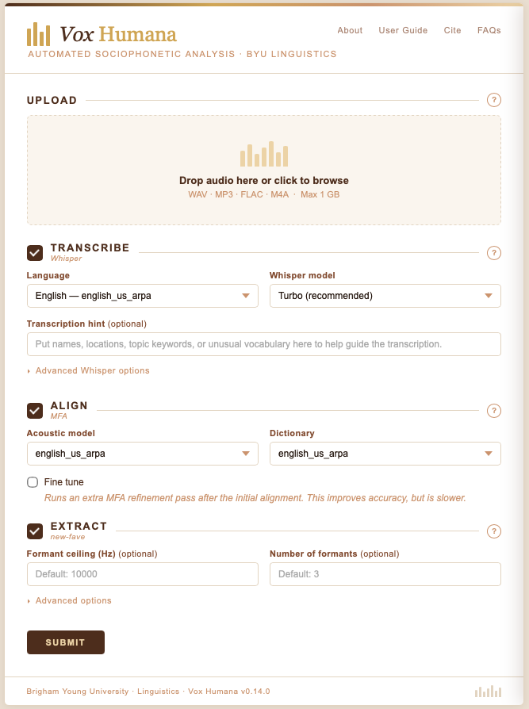
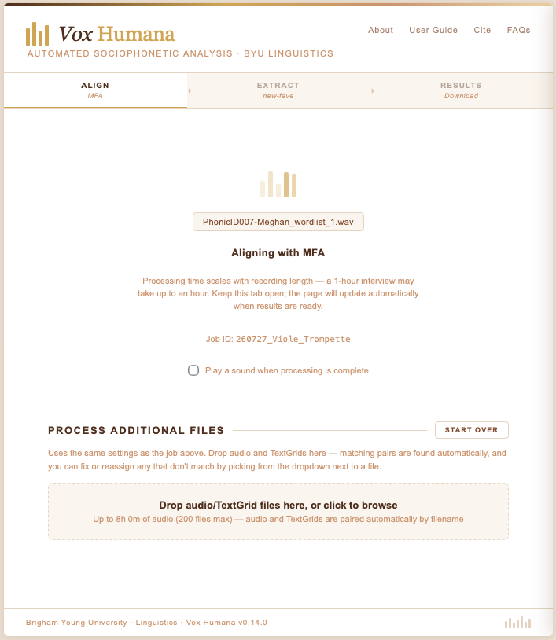
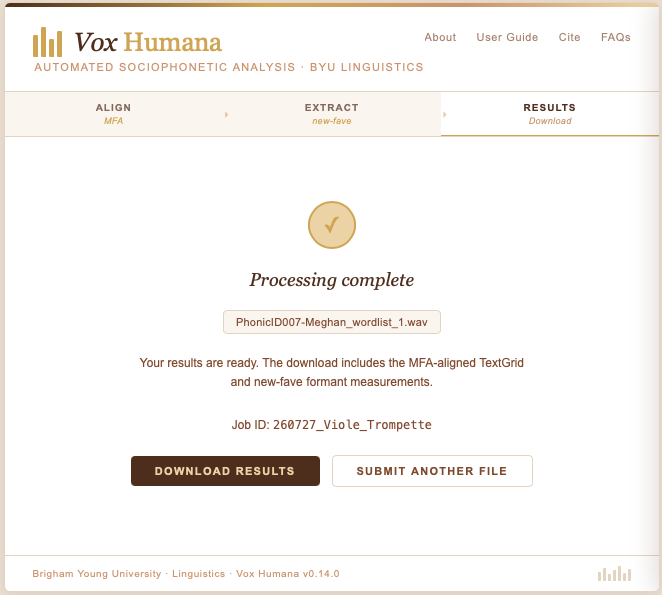
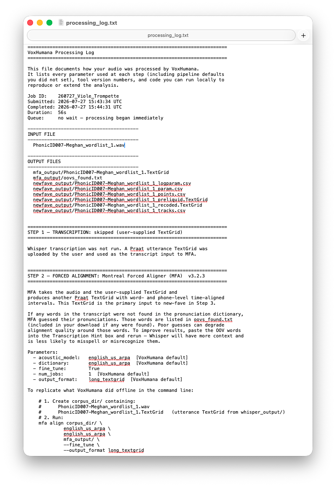
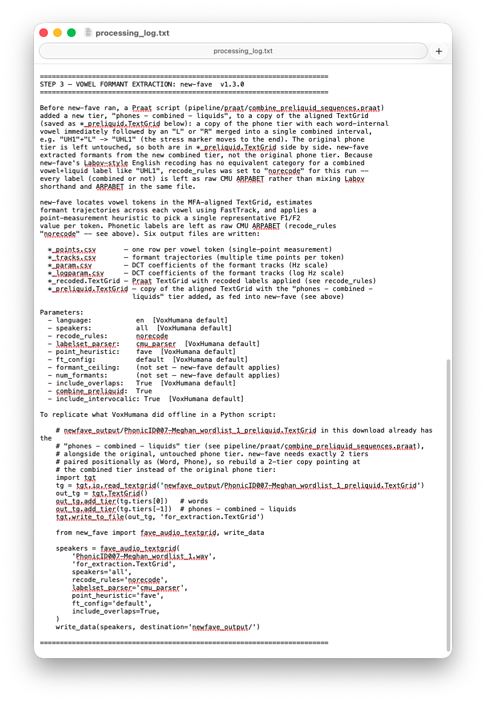
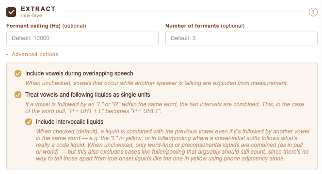

I'm excited to announce a soon-to-be-released online tool I've been working on called *VoxHumana* (*VxH*). With VoxHumana, you upload an audio file, and it'll send it through Whisper for automatic transcription, then to the Montreal Forced Aligner (MFA) for forced alignment, and then through new-fave for automatic formant extraction. With VxH, you can take raw audio and get a spreadsheet of acoustic measurements in just a few minutes using the latest software and without learning to code. 

:::{.callout-note}
My intention was to release VoxHumana later this year, but with earlier-than-anticipated [sunsetting of DARLA](https://jstanford.host.dartmouth.edu/DARLA_notification.html), I'm announcing VxH now before, before it is even live or has been beta-tested. Watch this space for updates and if you are interested in stress-testing VxH, let me know. 
:::

In this announcement post, I'll only highlight a few of what I believe are the most important features of VxH. 

### VxH, DARLA, Whisper, MFA, and new-fave

VxH is designed to be a "spiritual successor" to DARLA. By that, I mean that it is clearly inspired by DARLA but is not a direct continuation of it. VxH does much of what DARLA could do: transcription, forced alignment, and formant extraction. But it uses the latest software for each one. Instead of an in-house transcription method, VxH uses [Whisper](https://github.com/openai/whisper). Instead of MFA version 1.X, VxH uses [MFA](https://montreal-forced-aligner.readthedocs.io/en/latest/) version 2.x (with version 3.x coming soon). And instead of FAVE-Extract, it uses [new-fave](https://forced-alignment-and-vowel-extraction.github.io/new-fave/). To be clear, there is very little that VxH does that these component parts don't do already. There is virtually no in-house processing other than what Whisper, MFA, and new-fave offer. VxH basically strings the three pieces of software together into an easy-to-use interface. 

I've designed VxH so that it is clean and easy-to-use. When you upload a file, you can select which processing steps you want it to do (Whisper, MFA, and/or new-fave). I call this the "trolley" feature: you can get off and get back on the processing pipeline anytime you want. So, for example, you can send it through Whisper only so that you can correct the output before resubmitting it to be processed with MFA and new-fave. If you already have existing MFA output and just want to just new-fave, you can do that too. Because you can run each process independently, an unintended benefit of VxH is that it now serves as a point-and-click, web-based interface to Whisper, MFA, and new-fave.

:::{.callout-note}
It is worth pointing out that while VxH allows for some customization in Whisper, MFA, and new-fave, these three pieces of software can be configured and customized far beyond what is possible in a general-purpose web app. I encourage you to download these tools yourself and explore how they can best suit your data processing needs rather than rely exclusively on the limited options that VxH provides. 
:::

## Support for non-English languages

One benefit that VxH has over DARLA is that, because Whisper, MFA, and new-fave are language-independent, VxH now supports processing in some non-English languages. For now, it works on Spanish, Portuguese, French, and German. More languages wil be added soon. Be aware that VxH's output is only as good as its underlying components are. So, if Whisper's German transcription model is no good, VxH's output will be questionable. 

:::{.callout-note}
Since I do not work with non-English languages, I'm not able to robustly test these. I encourage feedback from those who use VxH for these languages.
:::

## Batch file processing

I often need to process many files at the same time with identical settings. I wanted to make it so that VxH could do that easily. Once you upload your file, you'll be taken to a processing screen that gives you status updates. On that screen, you can continue to upload files and they'll process using the same parameters that were used in the first file you submitted during this session. If you need to process TextGrids as part of this batch upload, VxH will attempt to pair audio and TextGrid files based on filename. You can then confirm each individual pair and it'll add it to the queue. 

## VxH Output

It was important to me that since users are running other software that they get all the output of that software. So, everything that Whisper, MFA, and new-fave returns will be part of the download bundle, organized into one folder for each tool. There will be a few other files too, like a TextGrid that is created based on the Whisper output. 

Additionally, VxH provides a processing log as a part of every job. This file includes a bunch of metadata about the job itself (date, time, names of the files uploaded, processing duration, queue position). It gives a human-readable explanation of the output files themselves. There is also Python code to reproduce the results exactly in case you want to do it locally. It also shows information about each of the three component parts, including version numbers and parameters used. This last one was important to me, not just for transparency but also to ensure consistency and reproducibility in linguistics research.

:::{layout-ncol=2}

:::

## Does VxH do anything special?

I explained above that VxH just strings together three pieces of software. I did hedge a teeny bit because there are a few things that VxH does in addition to what Whisper, MFA, and new-fave do out of the box. 

First, the Whisper output does not produce a TextGrid. So I use the [TextGridTools](https://pub.uni-bielefeld.de/download/2561620/2563287) package in Python to convert it into a TextGrid. 

Second, I personally like having my sentence/utterance tier combined with my phone and word tiers from MFA, so I combine them into the MFA output. That's a very small change.

The biggest contribution VxH makes though is that there's an option to combine vowels with following laterals and rhotics. So, a word like *pull* goes from "P"+"UH1"+"L" to "P"+"UHL1". This is helpful when working with these preliquids because the boundaries between them and the following consonants can be tricky to work with. That modified TextGrid is returned to the user. New-fave then processes those sequences as if they were vowels meaning you can get full trajectory data from them. 

## Other quality-of-life features

When you submit your file for processing, you'll be placed in a queue. Jobs are processed on a first-come-first-served basis. If there is a queue, you'll be able to see your position in it to give you an idea of how long it might be. 

If you would like to be notified when your file is complete, you can check a box saying you want a sound to play when the processing it done. 

Each job is assigned a unique ID. You're shown that ID as soon as your job begins to process. It also shows up in your output log. That ID is stored on the server side so if you run into issues, you can use that ID in communication with me. 

## Some caveats

Currently, there is no email system in place. With DARLA, you could submit your job, close your browser, and the files would be emailed to you. Right now, you have to keep the tab open. I would like an email system to be implemented, but I have no short-term plans.

## AI Disclosure

VxH uses a local installation of Whisper for automatic transcription. My understanding is that when it is done locally like this, it does not send submitted audio to OpenAI. Whisper does indeed work this way, even when not connected to the internet. From what I can tell in the documntation, this is how it works.

I also freely disclose that the code for VxH was written using Claude. I have never learned to code in Python and Python was the most appropriate language for this tool. My justification is that with the sunsetting of DARLA, the field needed a tool like VxH quickly, more quickly than I'd be able to do myself. And I don't have the means to hire someone to do this either.

